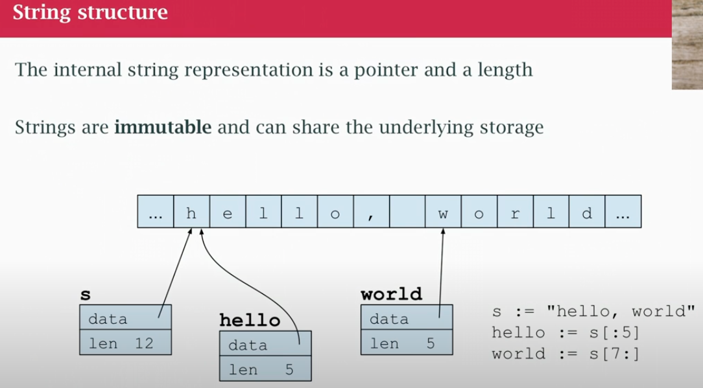

## class04

### strings

- need to think about strings in a "logical way" and "physical way"
- strings in go are all unicode
- technique to represent international characters
- old days ascii: 
    - represent a character with 7 bits
    - represent american english characters
    - basically, all characters fit into 1 byte
- international languages accent marks, non-roman languages like chinese and arabic
- we need technique to represent those
- unicode uses numbers that are bigger what fits into a byte
- a rune is the go equivalent of a 'character', sometimes called 'wide character'
- rune is a synonym for a int32 (that 4 byte is big enough to represent any unicode code point)
- a unicode code point is a numerical value that represents a specific character within the Unicode standard. It's essentially a unique identifier for each character
- but for effiency we don't wanna represent every character all the times with 4 bytes, a lot of programs are just gonna have a ascii characters
- theres a technique for encoding unicode called UTF-8
- a short way of representing unicode in bytes (invented by some who worked on go)
- Bell labs developed UTF-8 as an efficient way to encode unicode
- "physically" they are the UTF-8 encoding of unicode character
- theres a type called the byte (uint8)
- A string is physically a sequence of bytes required to encode the unicode characters that are there logically (the runes)
- the runes is a synonim for a 32 bit int.

Runes (characters) are enclosed in a single quotes `'a'`

**A STRING IS AN INMUTABLE SEQUENCE OF "CHARACTERS"**
- *physically* a sequence of bytes (UTF-8 encoding)
- *logically* a sequence of (unicode) runes

"Raw" strings use backktick quotes `string with "quotes"`
They don't evaluate escape characters such as \n

**THE LENGTH OF A STRING IS THE LENGTH OF BYTE STRING NECESARY TO ENCODE THE STRING IN UTF-8 **
- LOGICALLY/VISUALLY 5 CHARS
- PHYSICALLY IS 5 PRINTABLE CHARS

### How strings are represented in memory

- `s` is a 'string descriptor', describe something and has pointer within it
- it has a pointer to actual location in memory where this bytes are and additional info (number of bytes that make up the string)
- at the end of the string there is no no null-byte (like C)
- a string is a sequence of bytes, and Go determines the end of a string by its length, which is stored as part of the string's internal representation
- `hello` points to same characters in memory
- I can reuse that storage, because
    - this string don't have a trailing null-bye
    - are inmutable, they can't change once they have been lay down
- `world` is another part of that string `s`
- `hello` and `world` are stringe of their own (but substring of `s` reusing memory)
- reassinging the string `t := s` `t` is going to be a copy for `t` (same lenght and same pointer), but they are different descriptors.
- `d := s[:4] + slow + s[9:]` will point to a completly != memory
- `s[5] = a` CAN'T CHANGE PART OF THE STRING ONCE IT EXISTS
- `s += "es"` -->  `s := s = "es"`
- `s` is the descriptor, new chunk of memory, copy string add `es` at the end and `s` is gonna changed to point to new block of memory (the original string doesn't change)

### String functions

- `s = strings.ToUpper(s)` does it in the copy, the original `s`. So `s` is going to point to a different block that it used to.
- Go is a language collected language, if nobody else is using the old string it will be reclaimed
