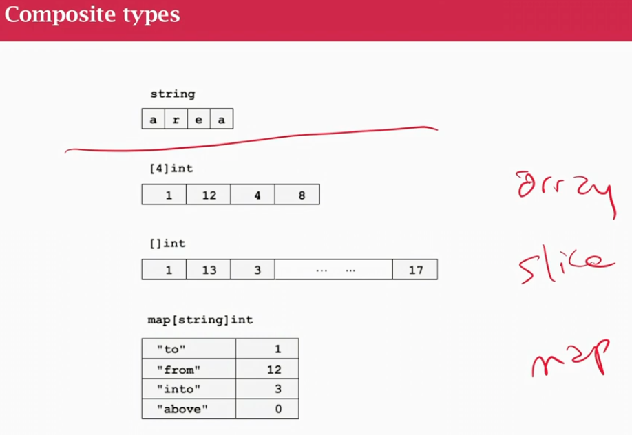
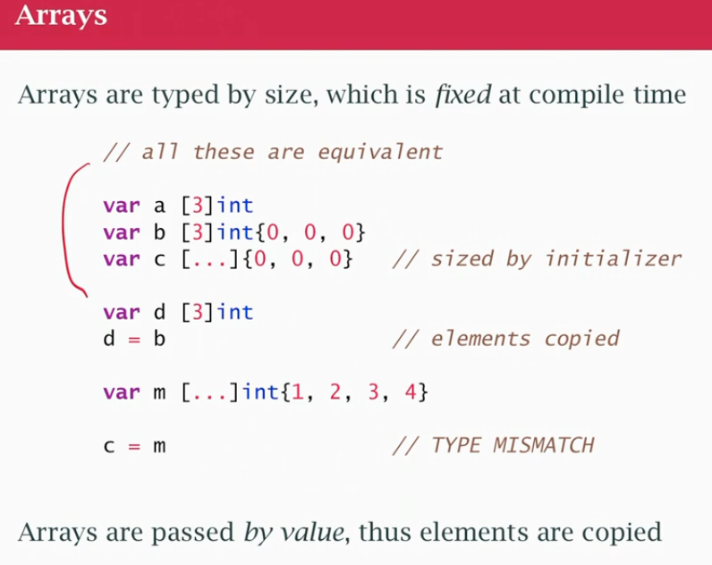
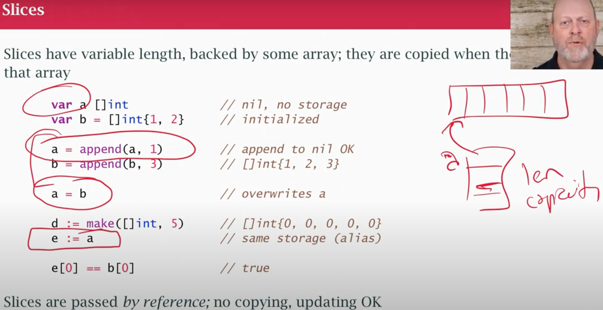
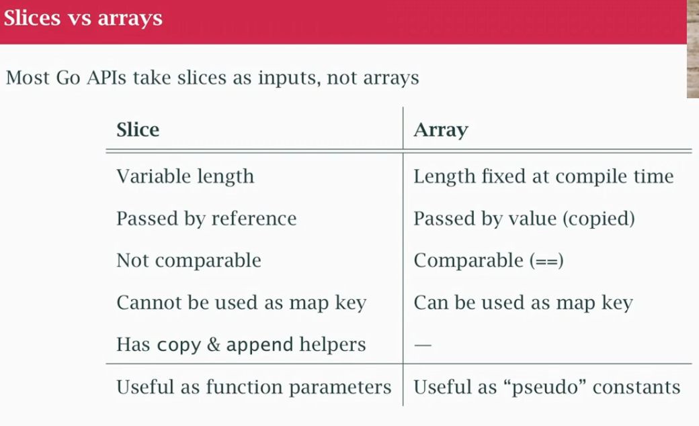

## class05

### Arrays, Slices and Maps



- strings 
- array:    `[4]int` sequence of things, typed, fixed at COMPILE TIME, lay in memory one next to another, need to say how big it is
- slices:   `[]int` sequence - variable length array
- map:      `map[string]int` map of string to integer, map of keys to values (not necessarily consecutive) 

#### Arrays

- arrays are not used a lot, because they are fixed sized
- assignment: new array `d` gets a copy of the `b` elements (ELEMENTS ARE COPIED, NOT SAME MEMORY)
- no 'descriptor' like strings (one string could point to another string)
- an array is a chunk of memory
- we just copy the bytes physocally (if large is inconvinient)
- `m` was created as an array of 4 integers, `c` is array of 3. They are != types (different size) can't be assigned 
- Arrays as pseudo-constants: useful to have fixed-size table of values in some algorithms, treated as constant data
- Can't put `const` keyword, use a var of type array (think it as a constant)

#### Slice

- like and array, but more like a string
- the slice has a descriptor and it points at some other memory
- it always has an array behind it (see red draw to the right)
- I have some array in memory, seq of things in bytes in memory
- Then I have variable `a` is a descriptor and part of descriptor points at those bytes (gonna work like strings), this implies it's easy to change `a` the same way we change strings (we can assign a new pointer at some other memory)
- The slice descriptor has a pointer, length and a capacity
- Various way to declare slices, theres also things that can modify it (append)
- `a = append(a,1)` takes slice `a` and an `element` `1` and put element in the end of the slice, assign the result back to `a`
- If `a` has a certain number of spaces and we used them old (lets say had space for 4 int), append the 5th, need to actually copy `a` and make it bigger, so we allocate a bigger chunk of memory, copy existing part of `a`, add new alement at the end and assign back to `a` by modifing the slice descriptor (it's just like `s += "es"` we got a new string somewhere else because it was bigger, but descriptior we updated by assigning back into it)
- assignment with a slice for example `a = b` `b` descriptor gets copied into `a` descriptor (`a` points at the same thing `b` pointed to)
- When we change the variable, we're changing the descriptor NOT necessarily the things it's describes behind the scenes
- `e := a` alias, `e` is a new variable, `a` is a copy of the descriptor
- The name [8:11] 11-8 = 3 elements (index 8,9,10) `for i := 8; i<11; i++ {}` `[8,11)`

### Slices vs Arrays

- Most Go APIs take slices as inputs, not arrays because it can represent an arbitrary amount of elements
- arrays fixed length, if we pass them around we copy them (copied around, not efficient)
- With array I can use comparison operator  arrays of fixed size `==` (it's unsafe in go to use slices)
- Slices are NOT COMPARABLES
- Map keys can't be slices since they are not comparable
- Slices has some helpers like `copy` & `append` 
- See slices everywhere, useful as function parameters

```
// [...] -> ... are gonna be replace whatever legth
var w = [...]int{1,2,3} // ARRAY len 3
var x = []int{0,0,0} // SLICE len 3

c := make([]int, 5) // []int{0,0,0,0,0}
c[4] = 42
copy(c,b) // copies only 3 elements

```
- pass array as parameter = values in array inside the function were copied to local variable
- pass slice as parameter = they change since they are the same underlying value (both points to same memory)
- I could slice an array `z := a[0:1]` `z` is a slice that points to first at first 2 elements of `a`
- Most of the time we are going to create slices (go will provide an array behind it to hold the values)
- Strings are inmutable, slices are changables

