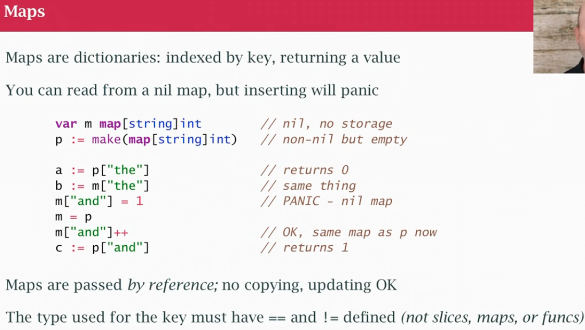
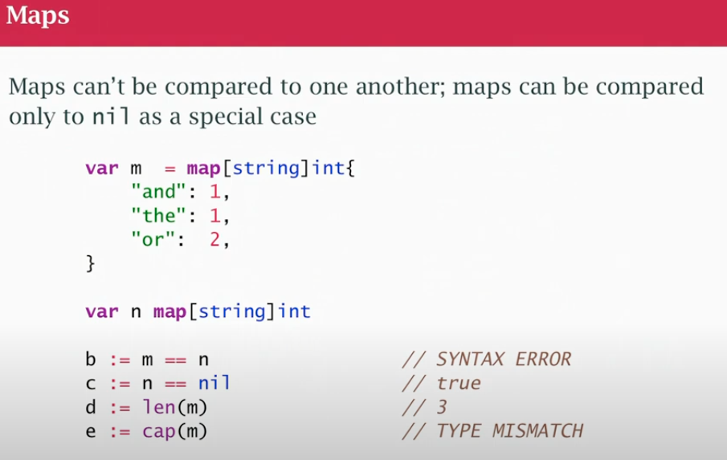

## class05

### Arrays, Slices and Maps


- strings 
- array:    `[4]int` sequence of things, typed, fixed at COMPILE TIME, lay in memory one next to another, need to say how big it is
- slices:   `[]int` sequence - variable length array
- map:      `map[string]int` map of string to integer, map of keys to values (not necessarily consecutive) 

#### Arrays

- arrays are not used a lot, because they are fixed sized
- assignment: new array `d` gets a copy of the `b` elements (ELEMENTS ARE COPIED, NOT SAME MEMORY)
- no 'descriptor' like strings (one string could point to another string)
- an array is a chunk of memory
- we just copy the bytes physocally (if large is inconvinient)
- `m` was created as an array of 4 integers, `c` is array of 3. They are != types (different size) can't be assigned 
- Arrays as pseudo-constants: useful to have fixed-size table of values in some algorithms, treated as constant data
- Can't put `const` keyword, use a var of type array (think it as a constant)

#### Slice

- like and array, but more like a string
- the slice has a descriptor and it points at some other memory
- it always has an array behind it (see red draw to the right)
- I have some array in memory, seq of things in bytes in memory
- Then I have variable `a` is a descriptor and part of descriptor points at those bytes (gonna work like strings), this implies it's easy to change `a` the same way we change strings (we can assign a new pointer at some other memory)
- The slice descriptor has a pointer, length and a capacity
- Various way to declare slices, theres also things that can modify it (append)
- `a = append(a,1)` takes slice `a` and an `element` `1` and put element in the end of the slice, assign the result back to `a`
- If `a` has a certain number of spaces and we used them old (lets say had space for 4 int), append the 5th, need to actually copy `a` and make it bigger, so we allocate a bigger chunk of memory, copy existing part of `a`, add new alement at the end and assign back to `a` by modifing the slice descriptor (it's just like `s += "es"` we got a new string somewhere else because it was bigger, but descriptior we updated by assigning back into it)
- assignment with a slice for example `a = b` `b` descriptor gets copied into `a` descriptor (`a` points at the same thing `b` pointed to)
- When we change the variable, we're changing the descriptor NOT necessarily the things it's describes behind the scenes
- `e := a` alias, `e` is a new variable, `a` is a copy of the descriptor
- The name [8:11] 11-8 = 3 elements (index 8,9,10) `for i := 8; i<11; i++ {}` `[8,11)`

#### Slices vs Arrays

- Most Go APIs take slices as inputs, not arrays because it can represent an arbitrary amount of elements
- arrays fixed length, if we pass them around we copy them (copied around, not efficient)
- With array I can use comparison operator  arrays of fixed size `==` (it's unsafe in go to use slices)
- Slices are NOT COMPARABLES
- Map keys can't be slices since they are not comparable
- Slices has some helpers like `copy` & `append` 
- See slices everywhere, useful as function parameters

```
// [...] -> ... are gonna be replace whatever legth
var w = [...]int{1,2,3} // ARRAY len 3
var x = []int{0,0,0} // SLICE len 3

c := make([]int, 5) // []int{0,0,0,0,0}
c[4] = 42
copy(c,b) // copies only 3 elements

```
- pass array as parameter = values in array inside the function were copied to local variable
- pass slice as parameter = they change since they are the same underlying value (both points to same memory)
- I could slice an array `z := a[0:1]` `z` is a slice that points to first at first 2 elements of `a`
- Most of the time we are going to create slices (go will provide an array behind it to hold the values)
- Strings are inmutable, slices are changables

### Maps

- Another built-in type
- behind the scenes there's hash table
- `var m map[string]int --> map[key-type]value-type --> lookup using string` (`m` is mil, it doesn't reference any actual hastable)
- `m` is another desctiptor: something that refers to a hashtable (at the moment is nil)
- `p := make(map[string]int) `
- string is immutable and comparable
- built-in function `make` for memory allocation and initialization. It allows to create slices, maps, and channels. Unlike basic data types, these complex types have an underlying structure that requires proper initialization before use.
- maps can be read from even when empty or nil, can't write to nil map , so need to 'make' it (create hashtable in the bg so we have a place to put keys and variables)
- `m` is another descriptor is something that refers to a hashtable (string descriptor has a pointer and length, array has pointer, a length and capacity)
- any time read key doesnt exist you get the default value of that type
- you can ask for an lenth of empty or nill map, you can read keys out of empty nill map, but you CAN'T WRITE only write keys to a map that exists - empty or not- a map variable is null (no hashtable behind it) it will crash
- `m = p` copies `p` descriptor into `m` descriptor, `m` points to same hashtable `p` points to
- Maps are passed by reference no copying
- the type used for keys must have == and != defined (not slices, maps or funcs)
- same as 2 slices referencing the same backing array or 2 strings referencing a sequence of characters

### Map literal

- `m` is a map starts with 3 keys and values. Put them in the code using a map literal {...}
- `n` is nil
- Can't compare `m` and `n`
- `cap` capacity leftover does NOT work for maps (work for slices)
- 2 ways to index a map: get 1 value o get 2 values
- `p := map[string]int{}` non-nil but empty
- `b , ok := p["and"]` returns 0, false (key missing)
- `p["the"]++` add 1 to key "the"
- `c , ok := p["the"]` returns 1, true 
```
if w,o := p["the"]; ok {
    // we know w is not the default value
}
```
- the 1st part declares 2 variables `w`,`ok` by indexing `p` with string `"the"`
- 2nd part is the **actual if condition** a boolean tells if i do the if logic

### Built-ins

- `len` length for string, array, slice, map
- arrays have a `cap` (constant, fixed size)
- a slice has a `cap` tells me how much more space is in the slice. A slice has some memory allocated, put 2 elements, len is 2, but still has excess capacity that i could append into before the slice gets reallocated into a new block of memory. So I can create a slice of cap 10, len 0. I can append 10 times it will be full, 11th element will be realocate it
- `make`function make slices and map, a way to actually constructing the store behind the descriptor
- slices have `copy` and `appemd` fn. 
- `c := append(c, d)` We're always gonna reassign the result of append back into the slice (slice of 10, add 11th, will have to reallocate for space for 16, copy the 10 ones and 11 one, now i have a different block of memory holding my elements). If I don't assign the result to append back to the variable `c` it will just refer to the old outdated won't show results of append.
- We can `make` maps
- We can `delete(m, k)` delete key k (safe to delete a non-existing key)

### nill
```
var s []int // declare variable s of type of slice of int, is nil, no slice
l := len(s) // 0 since empty (no need to check if nill first)
for _, v := range s { ... } //range over slice, if nil, will safely not do anything
```

```
var m map[string]int // map variable exists, descriptor exists, a nil map
i,ok := m["int"] // 0, false  
```

- KEY IDEA OF GO: "MAKE THE ZERO OR NILL VARIABLE USEFUL"
- if i declare var of type and get init to some logical init value, empty string, 0, nil pointers, safe to use