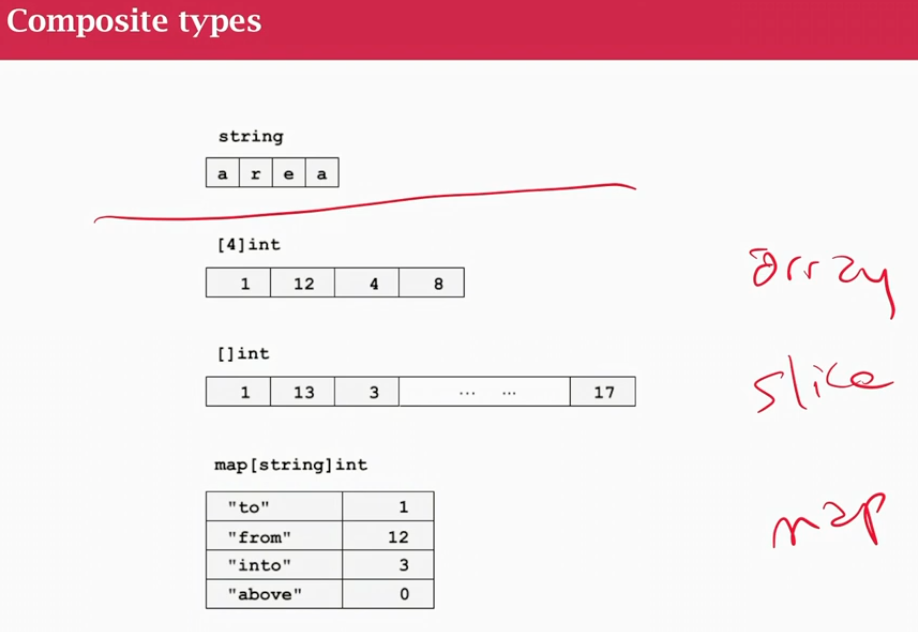
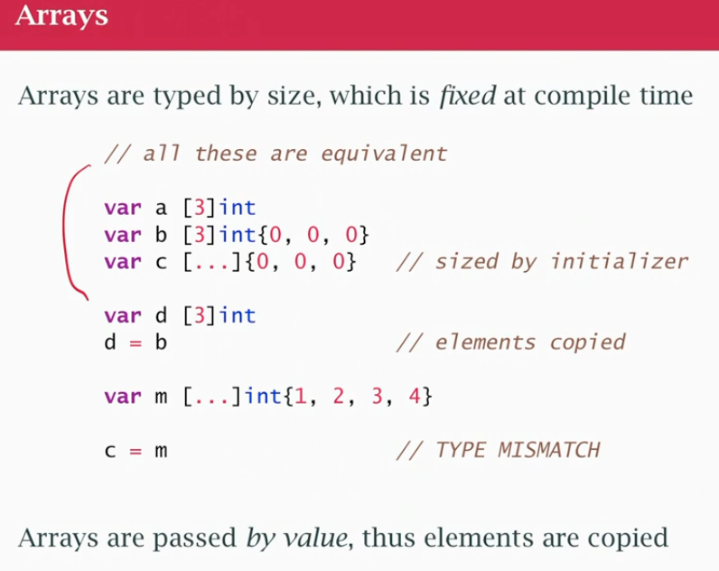

## class05

### Arrays, Slices and Maps

- strings 
- array:    `[4]int` sequence of things, typed, fixed at COMPILE TIME, lay in memory one next to another, need to say how big it is
- slices:   `[]int` sequence - variable length array
- map:      `map[string]int` map of string to integer, map of keys to values (not necessarily consecutive) 

#### Arrays

- array `d` assignment, get a copy of the `b` elements (ELEMENTS ARE COPIED, NOT SAME MEMORY)
- no 'descriptor' like strings (one string could point to another string)
- an array is a chunk of memory
- we just copy the bytes physocally (if large is inconvinient)
- `m` was created as an array of 4 integers, `c` is array of 3. They are != types (different size) can't be assigned 

#### Slice
- like and array, but more like a string
- the slice has a descriptor and it points at some other memory
- it always has an array behind it
- 

