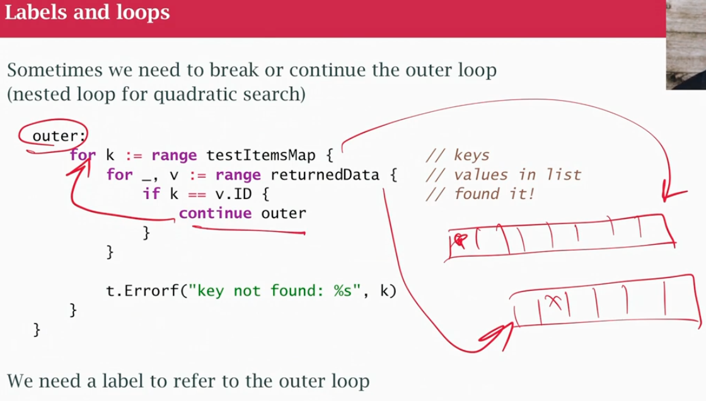
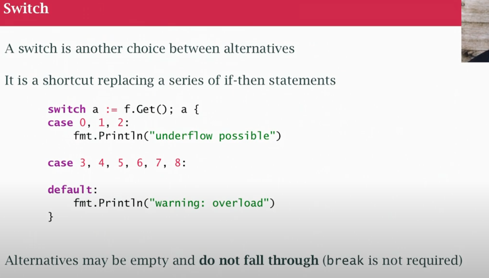
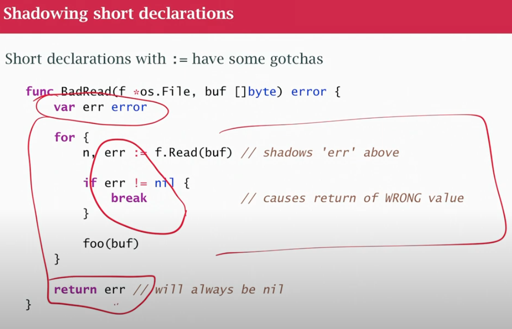

## class06

### if then-else
- "If braces are allowed, braces are required"
- if else statements require braces
- they can start with a short declaration of statement, a semicolon and then actual condition
```
if err := doSomething(); err != nill {
    return err
}
```

### for loop
- can have other types 
- 3 OPTIONAL parts semicolon
- initialization part variable, short declaration
- test/check part, do we iterate again?
- post iteration increment, where we change the loop variable. This can moved inside the loop
```
// 0 to 9, 10 fails the test
for i :=0 ; i < 10 ; i++ { }
```
- Go only has for loop
- `range operator` for array and slices a to work it's way throug
```
// i index 0,1,2
// v value at index gets copied to variable v, fine is mall, not fine if 4k block
for i,v := range myArray { }
```
- same for map k,v key value
- Maps, in go, doesnt have order, random order, want order? extract key, sort
- `for {}` infinite loop
- `break` statement stop loop
- `continue` make next iteration start early
- If you only want range VALUES, need **blank identifier**
```
// underscore is a placeholder
// _ ignores the index
// v is values 
for _, v := range MyArray { }
```
- `label` outer to refer to outer loop


- syntactic sugar for if else statements
- cases with discrete values
- cases break automatically (c need break)
- default will be evaluated last, but in the code it can be anywhere

- Go doesnt have enumerated types

### Packages
- package scope or function scope (inside of a function)
- types and variables in package scope
- A package can have more than 1 file, it can be 3 file in go code in `secret` package. `fmt.Println()` is uppercase, was exported, there are things inside `fmt` private to `fmt` package
- Every file in a package needs to import what it needs, not on the basis on the whole package
- `init` function get called when package starts up. Runtime can call `init` also before `main`
- The `const` keyword declares the variable as "constant", which means that it is unchangeable and read-only.
- every variable is init explicit value in code or compiler will give it a value based on the type
- declaration block (same as imports)
```
var (
    x,y int
    z   float64
    s   string
)
```
- declare a variable in a control structure like if use `:=`
- `x, err := getSomeValue()` it must declare at least 1 new variable (err already existed, so it's not redeclared)
- the `:=` is local in inner scope which are different (may be the same varible in outer scope) 

### Shadowing short declarations
- first err is always nill
- inside err stores Read error is lost because of break


### Named typing
- named typing `type x int` != `b :=12` type mismatch

- In go, no truthy, falsy values. Numbers and booleans are separe, not 1 is true 0 is false. I need to use a comparison operator
- In if statement is complicated put parenthesis for other devs to understand