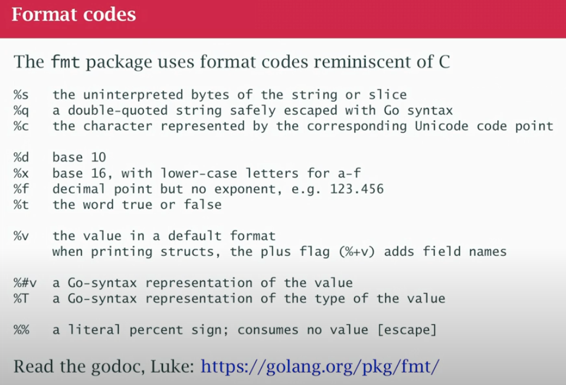

## class07



- `%v`   → Default format (values only).  
- `%+v`  → Like `%v`, but includes struct field names.  
- `%#v`  → Go-syntax representation (shows type info, field names, etc.).  

👉 `%#v` is really useful for debugging, because:

- It shows struct field names (while `%v` doesn’t).
- It includes type names and package paths when relevant.
- For slices, maps, pointers, etc., you see the exact representation that Go understands.

What if its a bunch of bytes? open a network connection and get a bunch of bytes back that have Json in them. But if they are a slice of bytes, the bytes of string are going to print as numbers, remember if looking at a `byte slice` look `[ 97 32 115 ..]` representing ideally characters, make sure you convert it back to string so you actually get the string output. You have to turn it back to legible text, Go doesn't know, by casting it to a string.

```
s := "a string"
b := []byte(s)
fmt.Printf("%v", string(b))
```

### File I/O

- `os` has function to open or creates files, list dirs, hosts the `File` type
- `io` has utilities to read and write
- `bufio` buffered i/o scanners
- `io/ioutul` read or write entire file to memory
- `strconv` parse numbers from text
- Always check the error, the file might not really be open
- `ReadAll` is return slice of bytes and error, that's what a file is. Read the entire file, if small ok. If large, I'll get a reaaly big slice of bytes, 1Terabyte, i don't have enough memory for that.