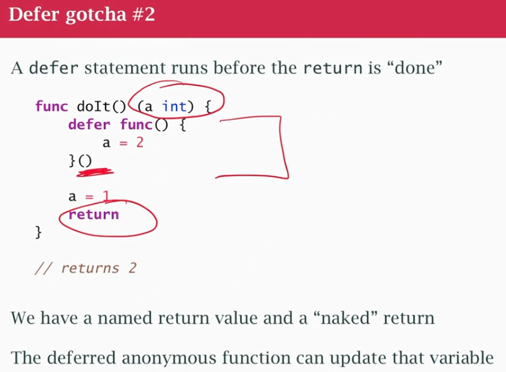

## class08
- Functions are 1st class object 
- you can almost anything with a function you can do with int or string: assign to var, pass a param, fn that return fn
- function signatue order and type of its parameters and return values (name of param is just local to the function)
- function declaration `formal parameters`
- call the `function actual` parameters specific to the call
- Param ~passed by value~ I'm copying it, get new copy of data. Caller can't see changes to the copy
- Param `passed by reference` if the function can modify the actual parameter, get a pointer to it. Caller sees the changes
- array pass by value, changing array inside fn doesnt change it
- slices passed by reference, they change (same pointer)
- map same as slice, passed by reference, change the original map

### How actually works
 - From technical pov, There's no such thing as passed by reference in Go
 - Every parameter is passed by value because the formal parameter is a local variable in the function, it gets assigned or copied the value of the actual parameter. If that value is a descriptor, you're refering to something refered from outside descriptor, so the slice descriptor gets copied into the slice descriptor of the parameter. they both point to the same actual table in memory, the slice descriptor is copied. Map descriptor was copied but they both pointed to the same hashtable. And 3rd case, pass pointer to the map descriptor, when i change the map descriptor in the function i'm also changing the map descriptor in the main function, so it changed (it became an entirely different map). 
 - So, in Go, everything is passed by value (pass int, string descriptor, struc by coping it, slice descriptor not the slice, ..). We copied the descriptor as a value parameter, the fact that is a descriptor, we still refer to outside data.

### Return values
- Go allows 1 or more return values on a function (need to put parenthesis) every return you have to return all the values
```go
func example(a string) (int,error) {
    ...
    return 1,nil
}
```

### Named Return Values in Go

**What they are**:  
Pre-declared return variables in the function signature that can be used like regular variables within the function.

**Key features**:
- Automatically initialized to zero values
- Can be modified like regular variables
- Returned automatically if you use a bare `return` statement
- Improve documentation by naming return values

#### Basic Example
```go
func Divide(a, b float64) (result float64, err error) {
    if b == 0 {
        err = errors.New("cannot divide by zero")
        return // returns (0, error) automatically
    }
    result = a / b
    return // returns (result, nil)
}
```

#### When to use:
1. **For documentation** - Makes return values self-documenting
2. **In defer blocks** - Allows modifying return values after main logic
3. **With multiple returns** - Clarifies which value is which

#### Defer Example
```go
func GetFileSize(path string) (size int64, err error) {
    f, err := os.Open(path)
    if err != nil {
        return // returns (0, error)
    }
    defer func() {
        if closeErr := f.Close(); closeErr != nil {
            err = closeErr // modifies the named return
        }
    }()
    
    info, err := f.Stat()
    if err != nil {
        return // returns (0, error)
    }
    size = info.Size()
    return // returns (size, nil)
}
```

**Important Notes**:
- Can make code less explicit if overused
- The `return` statement without values is called a "naked return"
- Not recommended for simple functions where regular returns are clearer

### Go Type Systems: Complete Reference

#### 1. Structural Typing
```go
type Car struct{ Speed int }
type Bike struct{ Speed int }

func Move(v Car) {
    fmt.Println(v.Speed)
}

func main() {
    // Move(Bike{Speed: 20})  // ❌ Won't compile
    Move(Car(Bike{Speed: 20})) // ✅ Must convert explicitly
}
```
**Use when**: Different types share identical structures but need explicit conversion.

#### 2. Duck Typing (Interfaces)
```go
type Speaker interface{ Speak() }

type Dog struct{}
func (d Dog) Speak() { fmt.Println("Woof!") }

func MakeNoise(s Speaker) {
    s.Speak()
}

func main() {
    MakeNoise(Dog{}) // ✅
}
```
**Use when**: You care about capabilities (methods) rather than concrete types.

#### 3. Type Comparison
```go
type UserID string
type OrderID string

uid := UserID("123")
oid := OrderID("123")

fmt.Println(uid == "123")          // ✅ Untyped constant comparison
fmt.Println(uid == UserID(oid))    // ✅ Explicit conversion
// fmt.Println(uid == oid)         // ❌ Types must have same name
```
**Key Rule**: For direct comparison between named types, they must have:
1. **The same type name** (exactly matching)
2. **Or explicit conversion** to the same type

#### Comparison Table
| Feature          | Requires                    | Example Valid               | Example Invalid         |
|------------------|-----------------------------|-----------------------------|-------------------------|
| Structural       | Explicit conversion         | `Car(Bike{})`               | `Move(Bike{})`          |
| Duck Typing      | Method implementation       | `MakeNoise(Dog{})`          | `MakeNoise(42)`         |
| Comparison       | Same type name or conversion| `uid == UserID(oid)`        | `uid == oid`            |

**Golden Rules**:
1. Structural typing needs conversion between types
2. Duck typing needs method matching
3. Comparison needs identical type names (or conversion)

### Recursion
- Go allow recursion
- A function can call itself
- it can also be done with a for loop, but need to book keeping, which using recusion book keeping is done for you using call stacks

### Deferred execution
- Sometimes we want to make sure things happen, 'Hey, at this point, I know there's something I need to do when i leave the function and I'm gonna record that right now and you'll do it when the function exits (whenever it exits)'
- Example to ensure the file closes no matter what
- The call to Close is guaranteed to run at function exit
- don't defer closing the file until we know it really opened
- doesn't matter which return got me out of the function
- can have more defer, the last one will execute first
- if there's a defer inside an if, but it will not execute when we leave the if block. The differ will happen when the function exits.
- defer inside a for loop, the defer won't happend at the end of a for loop, it will happend until function is done (defer is based on function scope). 

```go
func main() {
    f,err := os.Open("my_file.txt")
    if err != nil {
    ...
    }
    defer f.Close()
    //do something with the file
}
```

### Defer Inside a For Loop in Go

In Go, `defer` statements are executed **when the surrounding function returns**, not at the end of a loop iteration. They are executed in **Last In, First Out (LIFO)** order. So if you put a `defer` inside a loop, every iteration adds a new `defer` to the stack, and all of them only run once the function exits. This means resources like files may stay open much longer than you expect.

#### Example: Deferring in a Loop (❌ Problematic)
```go
for i := 0; i < 3; i++ {
    f, _ := os.Create(fmt.Sprintf("file%d.txt", i))
    defer f.Close() // all defers accumulate, run at end of function
    fmt.Println("opened (deferred close):", f.Name())
}
fmt.Println("loop finished") // only here do the files get closed
```
- Iteration 0 → schedules f.Close() for later
- Iteration 1 → schedules another f.Close()
- Iteration 2 → schedules another f.Close()
- At the end of the function all the deferred calls execute in reverse order → close file2, then file1, then file0. All files remain open until then.

```go
// FIX 1CLOSE IMMEDIATELY
for i := 0; i < 3; i++ {
    f, _ := os.Create(fmt.Sprintf("file%d.txt", i))
    fmt.Println("opened:", f.Name())
    f.Close() // closes right away
}
```

```go
// SCOPE EACH ITERATION WITH DEFER
// Here, the defer runs per iteration because each iteration has its own function scope.
for i := 0; i < 3; i++ {
    func(i int) {
        f, _ := os.Create(fmt.Sprintf("file%d.txt", i))
        defer f.Close()
        fmt.Println("opened:", f.Name())
    }(i) // new scope per iteration, defer runs at end of this inner function
}
```

### Key Takeaways

- Yes, all defer calls inside a loop accumulate until the function exits.
- They execute in reverse order (LIFO).
- If you want resources released per iteration, either close explicitly inside the loop or wrap the loop body in a function scope so defer runs per iteration.

### Defer 

```go
### Defer Copies Arguments to the Deferred Call in Go

In Go, when you write a `defer` statement, the **arguments to the deferred function are evaluated immediately** at the point of the `defer`, not when the deferred function is eventually executed. The actual function call is postponed, but the values passed to it are captured right away.

---

#### Example: Arguments Are Copied
```go
func main() {
    x := 10
    defer fmt.Println("deferred with x =", x)
    x = 20
    fmt.Println("after change, x =", x)
}
```
```
Output:
after change, x = 20
deferred with x = 10
```

Explanation:
- At the moment of defer fmt.Println("deferred with x =", x), the value of x is 10.
- That value is copied and stored with the deferred call.
- Later, when the function ends, the deferred Println runs, but it uses the captured value (10), not the updated one.

### Defer Copies Arguments to the Deferred Call in Go

In Go, when you write a `defer` statement, the arguments to the deferred function are **evaluated immediately**, not when the deferred function is executed. The function call itself is delayed, but the arguments are copied at defer time.

### Example: Arguments Are Copied
package main

import "fmt"

func main() {
    x := 10
    defer fmt.Println("deferred with x =", x) // x is copied now (10)
    x = 20
    fmt.Println("after change, x =", x)

    /*
    Explanation:
    - At the moment of the defer statement, x = 10 is copied.
    - Later, when the deferred Println executes, it uses the copied value (10), not the updated one.
    */

    /*
    Output:
    after change, x = 20
    deferred with x = 10
    */
}

### Example: Using a Function Call in Defer
package main

import "fmt"

func getValue() int {
    fmt.Println("getValue() called")
    return 42
}

func main() {
    defer fmt.Println("deferred:", getValue()) // getValue() executed immediately
    fmt.Println("main running")

    /*
    Explanation:
    - getValue() runs when the defer statement is encountered.
    - Its return value (42) is stored for later use in Println.
    */

    /*
    Output:
    getValue() called
    main running
    deferred: 42
    */
}

### Example: Capturing Pointers Instead
package main

import "fmt"

func main() {
    x := 10
    defer func(p *int) {
        fmt.Println("deferred with *p =", *p)
    }(&x) // pointer captured now
    x = 20
    fmt.Println("after change, x =", x)

    /*
    Explanation:
    - The pointer &x is captured at defer time.
    - When the deferred function executes, it sees the updated value of x (20).
    */

    /*
    Output:
    after change, x = 20
    deferred with *p = 20
    */
}

### Key Takeaways
- defer copies arguments at the time the defer statement executes.
- Passing values fixes them at defer time.
- Passing references (pointers, slices, maps) copies the reference, but underlying data can still change.
- Important for deferring calls that depend on variables modified later.

### Defer gotcha
