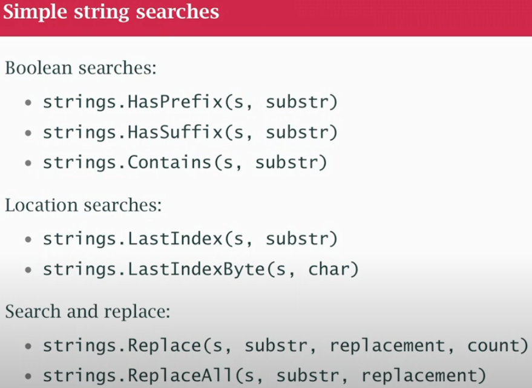

## class13

#### Runtime introspection example

- `" "` for strings (processed text)
- `' '` for runes (single characters)
- `` `` for raw strings (unprocessed text)

#### The Magic: Implicit Conversion
Go automatically converts the rune literal '/' to a byte because:

1. `LastIndexByte` expects a `byte` parameter
2. '/' is a rune literal (type rune)
3. But '/' fits within a byte (0-255)
4. Go performs implicit conversion: rune → byte

For Unicode, you must use LastIndex with string conversion

- [slides with examples](https://github.com/matt4biz/go-class-slides/blob/trunk/xmas-2020/go-13-regex-slides.pdf)