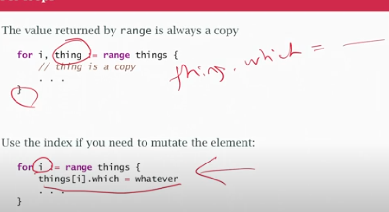

## class14

- pointers = shared (the different functions or part of the program are modifying the same data), not copied
- values = copied, we dont want shared
- Sometimes not sharing is safer, for concurrency, dont share it
- Common uses of pointers:
- something that can't be copied (use references, pointer to it)
- large objects are more expensive to copy, than to use a pointer to get to it.Cost to pointer: If I use a pointer to get to something, first read pointer variable out of memory, then 2nd memory read to get the actual data. 2 trips
- OOP, we may want to have a method that changes the object it's called on and that's going to be reference semantics
- decode protocol data, json unmarshall. pass reference so that json code would have a place to copy back into after decode
- when using a pointer to signal 'null'
- `sync.mutex`, can't copy, stop working. Work using pointer semantics
- `waitGroup` pass it as a pointer (doesnt work if copied)

### Stack allocation
- Stack allocation is more efficient (not use pointers)
- Accessing a variable directly is more efficient than following a pointer
- Accessing a dense sequence like an array than sparse data linked list

### Heap allocation
- escape analysis decide which things have to be on the heap, like closure closes over a local variable
- `new(x)` = `&x{}`
- new are going to confuse people (can be on stack or heap)

### for loop
- range is always a copy
- `thing` desapears
- use index, to mutate the element

### slice safely
- don't forget when use append to assign back to origanl slice variable
- when doing changes always return the slice
- risky: keeping a pointer to an element of a slice