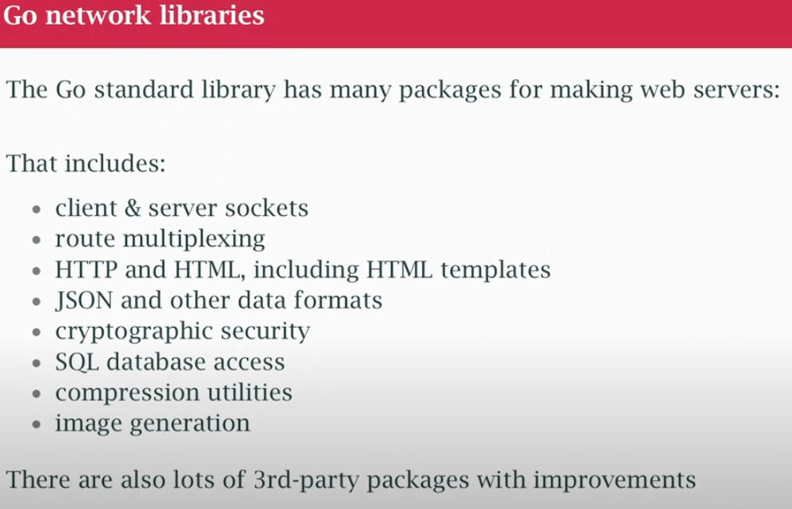
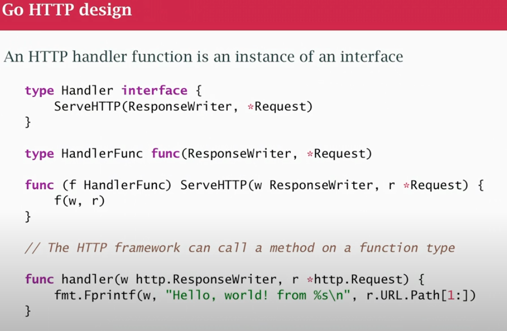

## class15
- Ho Go support HTTP networking 
- simple web server and clients and json
- Go was design to build software in the cloud (REST based server)



- Shorltly learn about OOP in Go
- interfaces and methods
- The HTTP service in Go standard is based on OOP
- we have an interface, `handler` has 1 method `ServeHTTP`method. It takes a `ResponseWriter` and a `*Request` as parameters
- We are looking for things that will implement that, we created a function called `handler`

```go
func handler(w http.ResponseWriter, r *http.Request) {
	fmt.Fprintf(w, "Hello, world! from %s \n", r.URL.Path[1:])
}
```
- handler is member of the `HandlerFunc` type, same 2 parameters, it's gonna match structuraly
- method declaration that runs on a `HandlerFunc` and does the `ServeHTTP` method by actually calling the function
- Go doesn't have classes, but Go allows methods to be put on any user declared type so I can create a method for a function and the method runs on the function, in this case, by just calling the function. Which means I can take a function that I wrote in the code, the `handler`function and use it as an object that satisfies the `Handler` interface with a `ServeHTTP` method, so that the web stuff in go can use that handler.
- We are not used to put method on things other than clases. Class are structs with methods, and here we can put a method on a function, why not? it's just an object.


