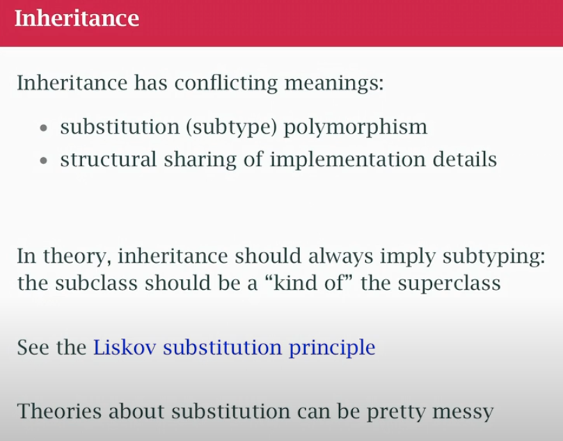

## class17 OOP

- **Go really is an OOP**


### Abstraction

- Logical notion of how we make things simpler
- Filesystem API, open/read/write without thinking OS buffers, how the FS works or the disk
- I shouldn't need to know
- We abstract the notion of file from all those underlying details


### Encapsulation


- I can't make that work without encapsulation
- Phisical simplifying of things, by hiding information
- I want my abstraction to be protected in 2 ways:
	- the user of abstraction doesnt know the details nor depend on them
    - you can call the functions I provide, you can't hack the internals

### Polymorphism


#### ad-hoc
- overload function names and operators
- Same function name, different implementations based on type
```go
package main

import "fmt"

// Ad-hoc polymorphism: same function name works with different types
type Speaker interface {
	Speak() string
}

type Dog struct{}

func (d Dog) Speak() string { return "Woof!" }

type Cat struct{}

func (c Cat) Speak() string { return "Meow!" }

func MakeSound(s Speaker) {
	fmt.Println(s.Speak())
}

func main() {
	MakeSound(Dog{}) // Works with Dog
	MakeSound(Cat{}) // Works with Cat
}

```
#### Generics
-  Same code works with different types (generics)
```go
package main

import "fmt"

// Parametric polymorphism: same function works with any type
func PrintSlice[T any](slice []T) {
	for _, item := range slice {
		fmt.Print(item, " ")
	}
	fmt.Println()
}

func main() {
	intSlice := []int{1, 2, 3}
	stringSlice := []string{"hello", "world"}

	PrintSlice(intSlice)    // Works with ints
	PrintSlice(stringSlice) // Works with strings
}
```

#### subtype
- around inheritance
- my sub-type is substitutitable for parent type (Circle is a type of Shape)
- Different types satisfy the same interface contract

```go
package main

import "fmt"

// Subtype polymorphism: different types satisfy the same interface
type Animal interface {
	Move() string
}

type Bird struct{}

func (b Bird) Move() string { return "Flying" }

type Fish struct{}

func (f Fish) Move() string { return "Swimming" }

func DescribeMovement(a Animal) {
	fmt.Println("The animal is", a.Move())
}

func main() {
	DescribeMovement(Bird{}) // Bird satisfies Animal interface
	DescribeMovement(Fish{}) // Fish satisfies Animal interface
}
```
### Inheritance



- structural sharing (most language allow the subclass to see innard of super class)
- subclass should be substitute. Declare a variable Shape and ask for area and actual variable is Circle and calculate are in a certain way, Triangule will calculate area different.
- Issues: 
 - if the subclass depend on the inners of superclass, if i change super break subclass
 - subtyping is leaky, shares part of behaviour. Shape class, Triangle and Sqare, Line? is a shape but doesn't have are (share some behaviours, it doesn't fit). My abstraction didn't fit.
- Inheritance is abused

### OO in Go

OOP by Alan Kay: objects that have protected state that talk to each other and polymorphism in behaviour. Go does those things:
- Go offers abstraction and encapsulation 
- And polymorphism through interfaces, not subtypes. No inheritance because there aren't any classes.
- What is a class? a struct with methods in most languages, you can only put method on structs
- Go is more flexible, you can add a method to any user-declared type
- Any object implement an interface and provide the behaviour without constraining to be part of a type hierarchy. 
- Go says "Inheritance is a problem, we are going to do OOP without it, we will have polymorphism, we provide separation of concern, between implementation and behaviour"

