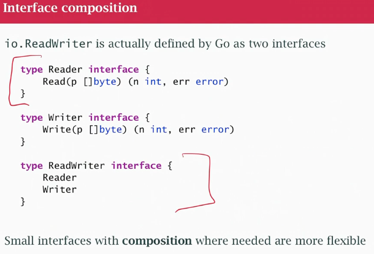

## class18 Methods and interfaces

- an interface is an specification of abstract behaviour, list a methods that a concrete object must provide
- a concrete offer methods that satisfy the interface
- in go we don't have classes and don't define method in them, we define them seperately
- a method is a function that also has a **receiver** (specified before the function name)

```go

type IntSlice []int

// the receiver is is (type IntSlice)
func (is IntSlice) String() string {
    strs []string

    for _, v:= range is {
       strs = append (strs, strconv.Itoa(v))
    }

    return "[" + strings.Join(strs, ";") + "]"
}

```

- in go, we can put methods on any user declared type 
- print function, is it a string? copy the string to the output, is it a stringer? call the string() method generate the string and put it in on the output.
- Interfaces are Contracts, not Types. Think of an interface not as a thing but as a set of rules or a contract. The fmt.Stringer interface is a contract that says: "Any type that has a method String() string automatically fulfills this contract and can be used wherever a fmt.Stringer is expected."

When you declare var s fmt.Stringer without assignment:
```
var s fmt.Stringer
fmt.Printf("%T: %[1]v \n", s)
```

- Both components are nil
- There's no concrete type associated with it
- There's no concrete value stored
- This is different from a non-interface type where %T would always show the static type

### Why interfaces?


- instead of writing many functions for many concrete types, we define our function in terms of abstract behavior (something we write to)
- interface in the io package called Writer, specify a Write method, it takes a byte slice
- byte slice is the common denominator
- no strings, not slices, not part of actual hardware
- no `implements` keyword. Why? interfaces in go is from the consumer not the provider side.
- "I'm some piece of function and I need a parameter that provide certain behaviour, I (the consumer) want this particular interface with this particular method set to provide this behaviour.
-  Its up to the provider to provide the right methods.
-  I can have existing objects in a program with methods and create new interface somewhere else with something like Write (that is the behaviour I want as a consumer) only want to capture one piece of behaviour.
- Go does typing is structural, that way we do interface in go, any type that provides the right methods to satisfy the interface is a member of the interface type, we don't say implements, its automatic.

### Go Interfaces: Consumer-Driven & Structural
In Go, interfaces are defined by the consumer (the code that uses them), not the provider (the type that implements them).

- The Consumer (fmt package): Defines the Stringer interface because it needs the String() behavior to print values.

- The Provider (IntSlice): Implements a String() string method for its own reasons, completely unaware of Stringer.

#### How They Connect: Structural Typing
Go uses structural typing ("duck typing") for interfaces. The compiler automatically checks if a type's structure (its method set) matches an interface's requirements. There is no implements keyword.

fmt asks: "Do you have a String() string method?"

IntSlice answers: "Yes, I do."

Result: IntSlice silently satisfies Stringer and works with fmt.Println.

#### The Power: Retroactive Compatibility
This means you can define a new interface today that describes what an existing type already did yesterday, and they will work together automatically. This creates incredibly flexible and decoupled code.

### Not just structs
- A method may be defined on any user-declared (named) type not just structs
- I can't put methods on int, built in types don't have methods, there are functions that work on them. I wrap them in another type (may need type conversion, but they are compatibles underneath)

### Receivers


Two kinds: pointer and value

- value receiver: the method gets a copy, `Offset` takes `x` and `y` values, adds them to actual receiver but returns a new Point (receiver `p` is not changed, can't be chaged, it came in as a copy)

- pointer receiver: `Move` actually changes the coordinates of receiver (original object). Change the Pointer receiver . 

### Interface and substitution

```
var w io.Writer
var rwc io.ReadWriteCloser

w = os.Stdout 
rwc = os.Stdout  
```

- os.Stdout is a file pointer and files have the same behaviour
- os.Stdout is *os.File has all 3 methods

### Value Receiver

```
type IntSet map[int]bool

func (s IntSet) String() string {
    return "IntSet implementation"
}

// This WILL compile:
var _ = IntSet{}.String() // OK
```

#### Pointer Receiver Case
```
type IntSet map[int]bool

func (s *IntSet) String() string {
    return "IntSet implementation"
}

// This will NOT compile:
var _ = IntSet{}.String() // ERROR: cannot call pointer method on IntSet literal
```

The error occurs because:
- IntSet{} creates a value (not a pointer)
- String() expects a pointer receiver (*IntSet)
- Go cannot automatically take the address of a temporary literal (value not tied anywhere, no place, no address, no pointer)

#### Solutions if you have a pointer receiver:
1. Create a variable first (created variable and it has a place)
```
s := IntSet{}
var _ = s.String() // Works - Go automatically takes address of s
```

```
type IntSet struct { }
func (*IntSet) String() string
var s IntSet
var _ fmt.Stringer = &s // OK
var _ fmt.Stringer = s // ERROR
```
- fmt.Stringer represents an object that has a String method
- But we defined the String method (of IntSet) to work on the pointer reciver
- to make the assignment work I have to have the address of object 

### Interface Composition



- *File is Reader and Writer
- Interfaces should be small (OK 1 method interface)
- I want multiple behaviours compose them

### Interface declarations

- LIMITATION: you have to declare the methods in the same package (as the concrete type)
- when Go compiles, it wants to know all the methods for the type all at once
- In Go, we want **static typing** (we want to know all methods that type has)
- We CAN'T extend a type by adding methods in a different package, we can extend the type (composition of structs)
- Similar way i took int wrapped in ByteCounter. 
- I can create a struct that embeds another struct (I may have to do some type casting)

```go
type Bigger struct {
    my.Big // get all Big methods
}
func (b Bigger) DoIt() { // add more method here
    ...
}
```
- Bigger is not a Big (need to do type casting)
- Bigger has one more method and Big methods

### Last notes
- interface Stringer -> String
- interface Distancer -> Distance
- interface Writer -> Write
- Composition is not inheritance, I have a Point in it, but is not a ColoredPoint, not a sub-class 