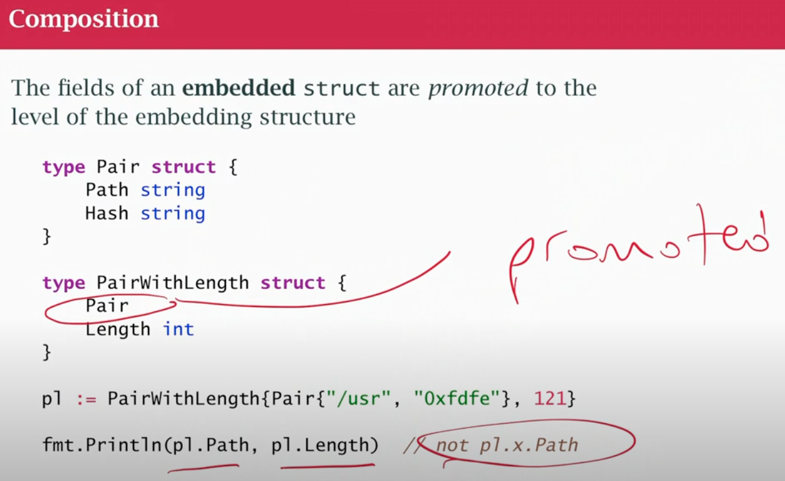
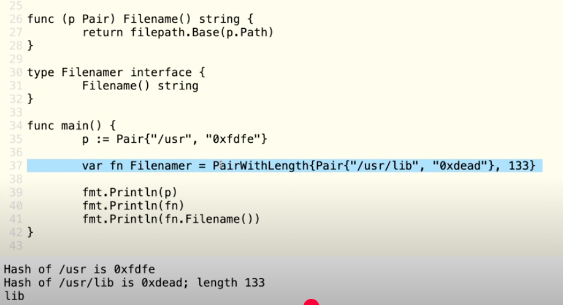
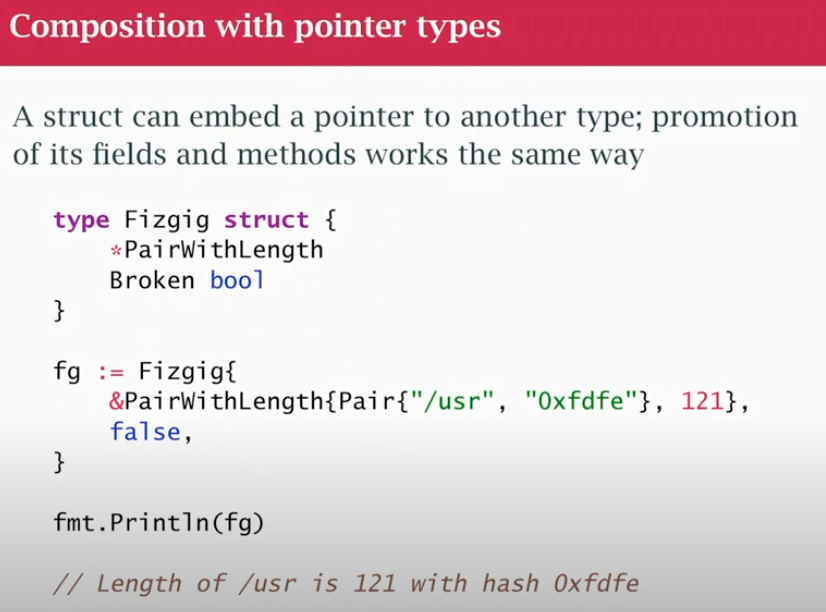
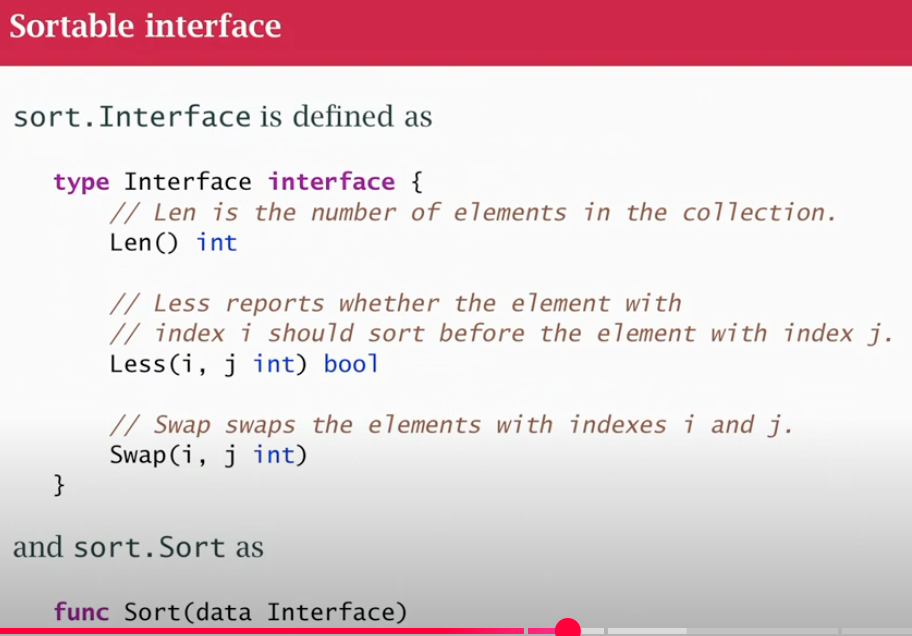
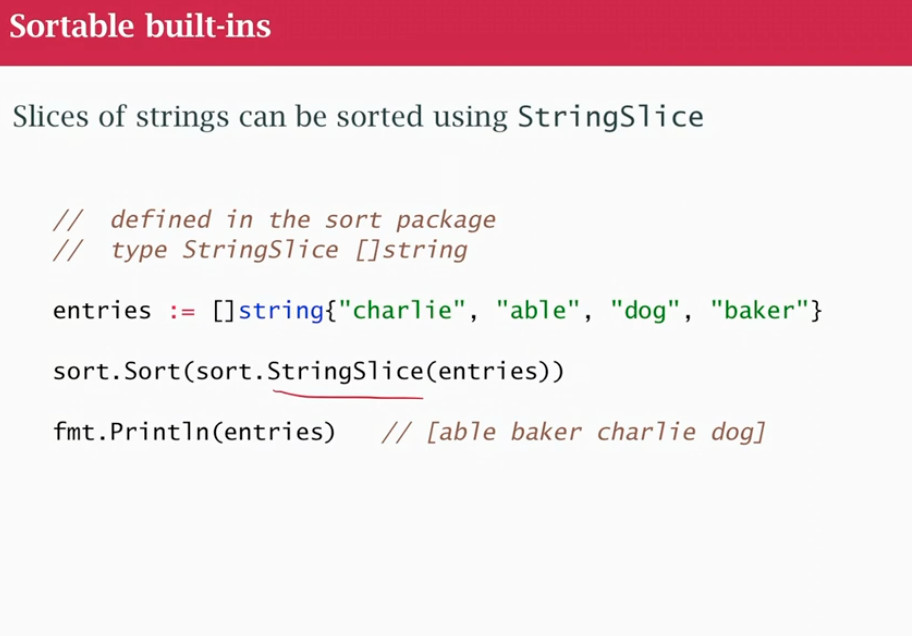

## Class 19 Composition



- embeded in the SAME level, not `pl.x.Path`
- I embed a type within a type even if not s struct
- promotion: fields and methods (for example String method of Pair gets promoted to PairWithLength)
- A PairWithLength is not a subclass/subtype of Pair
- `pl.Pair*()`
- inheritance pick up field from parent class, subclass of parent class, in go we don't have inheritance: we're pulling in the fields of Pair, embedded in PairWithLegth. We are promoting into PairWithLength but they are different types


- both Pair and PairWithLength can be examples of Filenamer, because method was promoted into PairWithLength

### Composition with pointer types



- embeds a pointer to PairWithLenth
- when printing it's calling the String method of PairWithLength because I embeded it (even if it's a pointer)

### Sortable interface





#### Sort.Reverse
- Sort.Reverse is a struct that embeds Interface
- The interface sorting type has 3 method Legth, Swap and Less
- the methods of interface are promoted into Reverse, and redefines Less, calls the interface.Less reversed
- function Reverse returns interface with embeds your data
- Just takes your Less methods and turns it backwards

```
type reverse struct {
    sort.Interface  // Embedded interface
}

func (r reverse) Less(i, j int) bool {
    return r.Interface.Less(j, i)  // Note: i and j are swapped!
}

func Reverse(f sort.Interface) sort.Interface {
    return &reverse{data}  // Returns a reverse wrapper
}
```

- data is a variable of type sort.Interface - meaning it can hold any value that implements these three methods:
    - Len() int
    - Swap(i, j int)
    - Less(i, j int) bool
- data could be ByWeight{s}, ByName{s}, or s (if Organs had its own Less() method)

##### When you call sort.Reverse(ByWeight{s}):

1. `ByWeight{s}` creates a struct containing your organs slice
2. This gets passed as data to the Reverse function
3. Reverse wraps it in a reverse struct:

```go
&reverse{
    Interface: ByWeight{      // This is your 'data'
        Organs: Organs{       // This is your original slice
            {"brain", 1340},
            {"liver", 1494},
            // ...
        }
    }
}
```

### Nil as a receiver

Nothing in Go prevents calling a method with a `nil` receiver