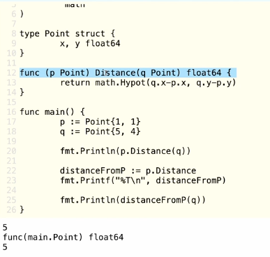

## class20 Interface and Methods in Detail

### nil interface

```go
// Define a simple interface
type Speaker interface {
    Speak() string
}

// Create a concrete type that implements the interface
type Dog struct {
    Name string
}

// Implement the Speak method for Dog
func (d Dog) Speak() string {
    return "Woof! My name is " + d.Name
}

// Interface variable holding a Dog
var speaker1 Speaker = Dog{Name: "Buddy"}
```

- a variable of interface type the default is nil (int is 0 for string is empty string)
- has two parts (think of 2 pointers):
    - (actual concrete type) a value or pointer of some type 
    - (what type that value is) a pointer to type information so the correct actual method can be identified

```go
var r io.Reader     // nil until initialized (variable of interface type)
var b *bytes.Buffer // nil (pointer to a byte buffer)

r = b               // r is not nil but it has a pointer to a Buffer
```


- after assignment, the interface is NOT nil: nil buffer pointer, but I know I point to a Buffer

### Error interface

```go
type error interface {
    func Error() string
}
```

- error is an interface with one method Error returning a string describing the error
- is an interface because we can customize error (is not always a string, have traceback...) the value in the error may be more complicated than a string, it may have other data, call error method look that data and format into string


- is oops because XYZ returns a nil pointer to a concrete value and that gets copied to an interface
and the interface is not longer nil (even if has nil pointer inside)
- the fix:


- change XYZ retun a nil error interface value
- return a nil interface
- the common thing is to check if error is nil or not (difference nil pointer vs interface having a nil pointer)
- avoid return concrete error types nil


- Point{1,1}.Add(2,3) Point{1,1} is R-value just like the string "abc" or int 1. They are not addressable!


- pointers for things that cannot be copied like buffer (embeded mutex)
- not safe to make a copy of a buffer
- **If one method of a type takes pointer receiver, in general, all methods of the type should take pointer receiver**

### Currying functions
- currying is the process where we take a function that has for example 3 parameters, bind one of them and turn them into function that has 2 parameters


#### Method value
- Is a method closed over its receiver. Method is a special function it has a normal parameter list and special paramter called receiver.


#### print type using %T



#### same value


#### pointer receiver


- A method value works like a normal closure if you take a pointer receiver but it captures the value inmmediately if value receiver.

#### Empty interface
- empty interface `interface{}` can be anything
- in a sense, is like a void pointer in c or c++
- Reflection is needed to determine correct