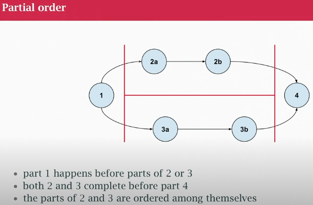
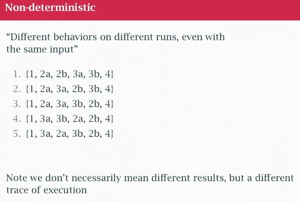
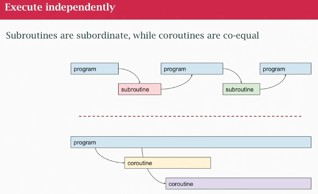
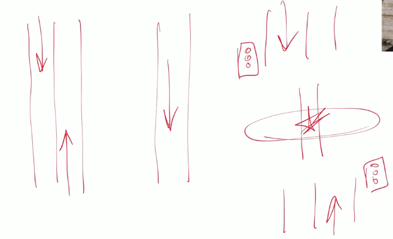

## class22 What is concurrency?

### partial order (!=total order)

### non deterministic

### execute independently

- coroutine runs along side your main program (not at the same time, if 1 cpu 1 core)

### Concurrency

**Parts of a program may execute independently in some non-determisnitic (possibly partial) order**
- not necessarily have complete control over how all the parts work and potencial (depends on HW) can run at the same time (parallel)
- 1 core world (interrupts in O.S)
- need concurrency to enable parallelism
- concurrency DOES NOT make you program faster, in fact, if 1 core may run slower. For faster, having parallelism ability to run multiple cores
- Concurrency can make you faster, stop for external things, wait for server to response, I can do something else.
- **Is about dealing with things happening out-of-order**

### Paralellism
**Parts of a program execute independently AT THE SAME TIME**
- only if I have multiple CPUs or cores in a CPU
- **Is about things actually happening at the same time**

### Problems with concurrency
- Race condition: possibility that my out-of-order non-deterministic may get something wrong. One of the possible choices where the program may produce wrong output (can be random, non-deterministic)
- a race condition is a bug (can randomly produce wrong answers)
- make ATOM (non-divisible) operations like Read and Write

### Solutions

Race conditions involve independent parts of the program changing things that are SHARED
- don't share anything
- make them read-only
- allow only one writer
- make read-modify-write atomic

### Roads analogy

1) two lane road, don't interfere (may be read only, no slow down)
2) everyone goes to the same direction
3) two lane road and 1 bridge, put a traffic signal, it will be only north or only south or I get an accident. Stop ligths are the cost, I lose performace but I gain safety

