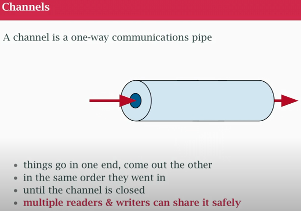
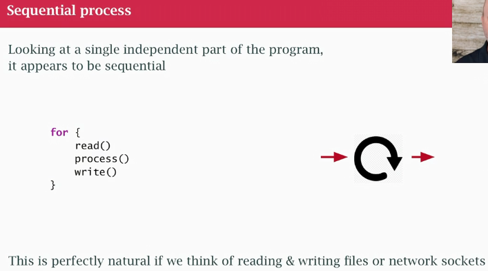
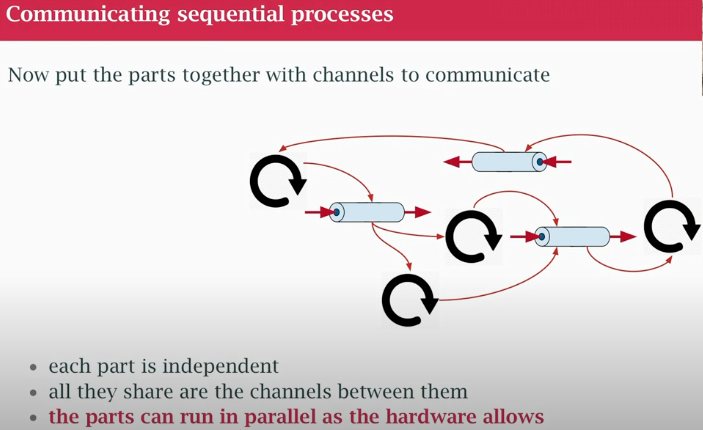

## class 23 CSP, Goroutines and Channels

### Channels



- A channel is like a unix pipe (way to send data from one program to another in command line using | and redirect the output to the input of another)
- The programs run in paralel or concurrently (depending on the hardware) as data comes out of the 1st program is read by the 2nd 
- Pipes and channels in go:
1) stuff comes goes in one end comes out the other (unidirectional)
2) stuff comes out in order, keeps coming out until the writing end is closed
The difference is: In Go it's safe to have **multiple readers and writers** for a pipe (un command line usually not multiple) Channels are safe for this purpoise.

### Sequential process


- if I run grep on a text file I have a loop in there
- 1,2,3 and do again, no concurrency

### Communicating sequential processes



- When we put sequentials processes talking through channels
- Allows this sequentials process to be concurrent as a group
- Run in parallel as data flows from one part to the next

### CSP
- CSP model allows us to write async code in a async style
- I write a message to something else. How message get scheduled and and how these something get scheduled across the CPU (is not my problem, it works)

### Goroutine
- it's coroutine
- A goroutine is a unit of independent execution (coroutine) 
- we use the go keyword to start it
- put `go` in front of a `function call`
- The function call starts an independent thread of execution (a goroutine is not a thread, a go program can have tens of 1000s of goroutines and Go will take care of scheduling on how many thread it needs based on your CPU hardware)
- What stop a goroutine? (leak, orphan stuck not gonna finish hold to resources)
1) you have a well-defined loop terminating condition
2) you signal completion through a channel or context
3) let it run until program stops
You need to make sure it doesn't get block by mistake

### Channel 
- is a data type
- represents a way of communicating
- like unix pipe (1 way channel, put stuff in one end it comes out in the right order in the other end)
- SAFE FOR MULTIPLE READER AND WRITERS
- method of synchronization and as communication
- pass data through it
- transfer ownership of data. Think a sequential process, generate some piece of data, sends it through a channel to another. By sending its giving the ownership. In theory, as long as one goroutine has that data at a time, the race conditions aren't a problem
- role as sync tool: communicate something is done

### Exercise
```
time go run main.go 
2025/09/10 00:09:25 https://wsj.com      66.578ms 
2025/09/10 00:09:25 https://nytimes.com  126.696ms 
2025/09/10 00:09:25 https://google.com   285.833ms 
2025/09/10 00:09:25 https://amazon.com   564.035ms 
go run main.go  0.29s user 0.29s system 82% cpu 0.707 total
```
- The whole thing took less than a second, If i add all the times they add more than 1 second, so they didn't run sequentially. Each URL lookup is less than a total time to run my program