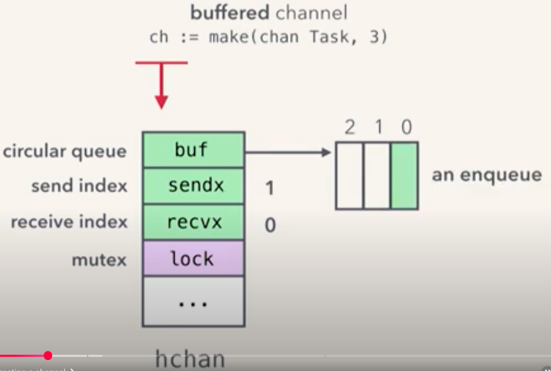
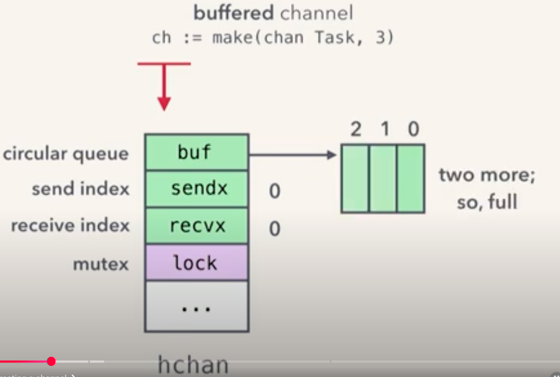
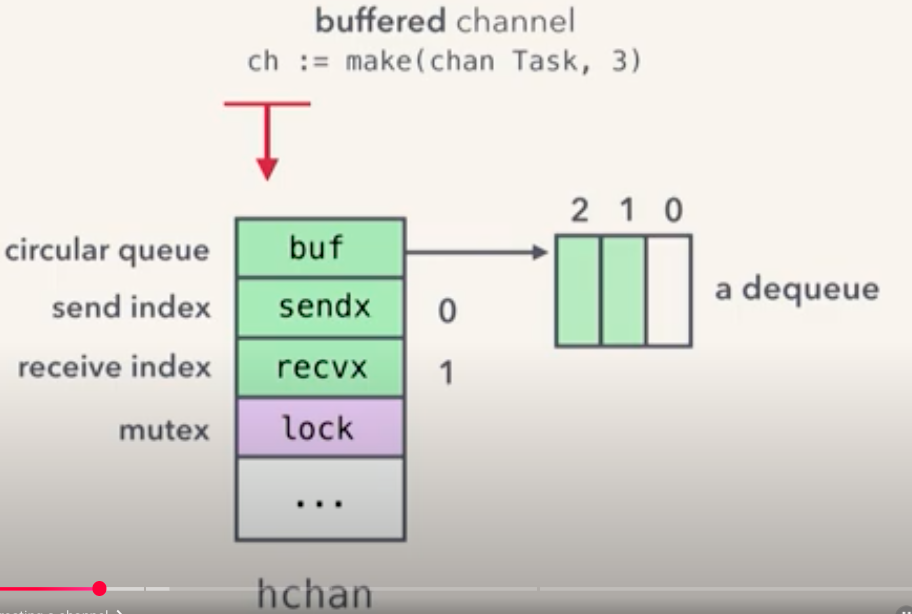
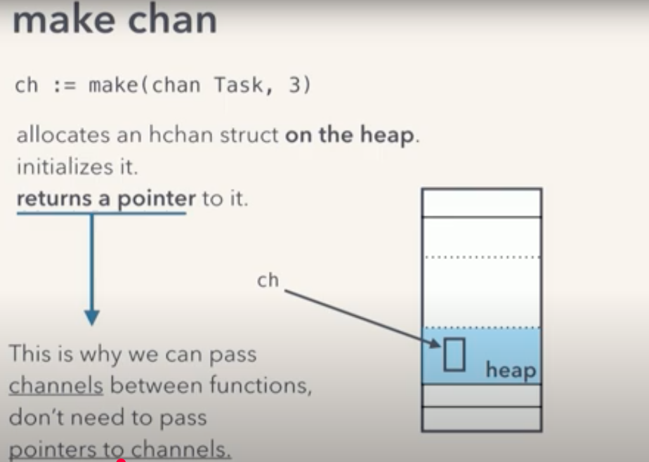
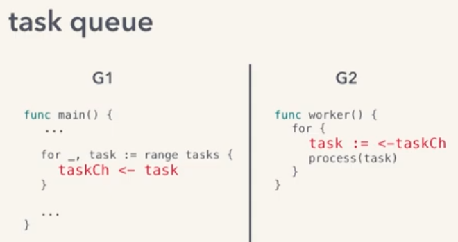
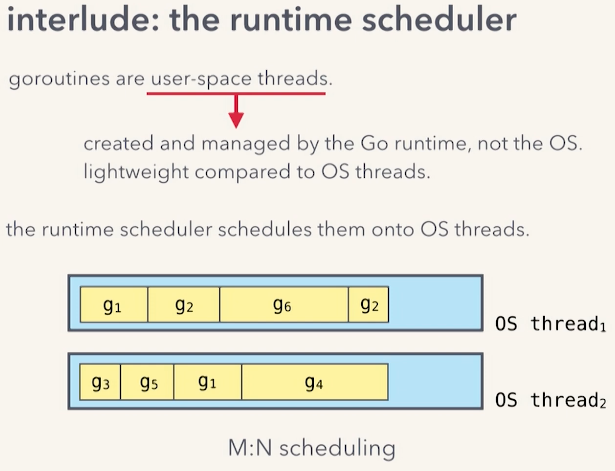
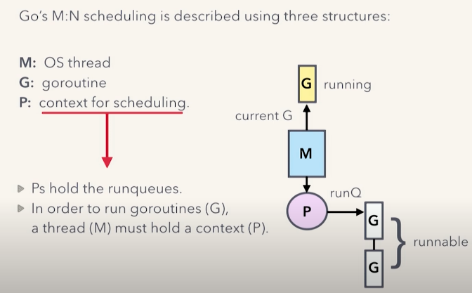
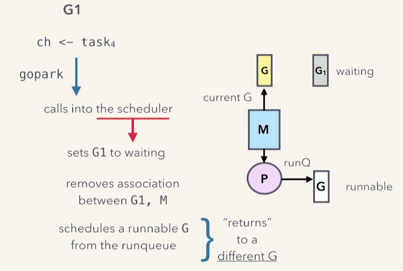
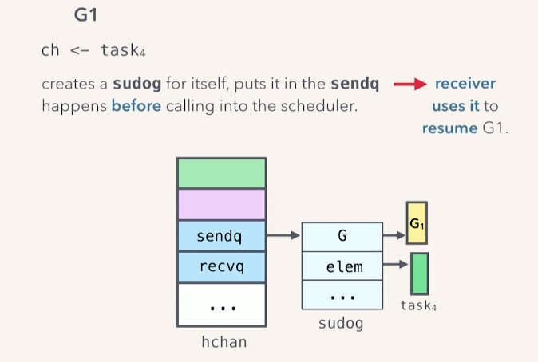

## class 23 CSP, Goroutines and Channels

### Channels


- A channel is like a unix pipe (way to send data from one program to another in command line using | and redirect the output to the input of another)
- The programs run in paralel or concurrently (depending on the hardware) as data comes out of the 1st program is read by the 2nd 
- Pipes and channels in go:
1) stuff comes goes in one end comes out the other (unidirectional)
2) stuff comes out in order, keeps coming out until the writing end is closed
The difference is: In Go it's safe to have **multiple readers and writers** for a pipe (un command line usually not multiple) Channels are safe for this purpoise.

### Sequential process


- if I run grep on a text file I have a loop in there
- 1,2,3 and do again, no concurrency

### Communicating sequential processes


- When we put sequentials processes talking through channels
- Allows this sequentials process to be concurrent as a group
- Run in parallel as data flows from one part to the next

### CSP
- CSP model allows us to write async code in a async style
- I write a message to something else. How message get scheduled and and how these something get scheduled across the CPU (is not my problem, it works)

#### Eric Shull: Communicating Sequential Processes
- sharing memory, non determinism (depend on OS scheduler, creates race conditions)
- update a number at the same time
- effort to solve, mutex or locks, can produce deadlocks
- dificult to debug and reproduce, hard to ensure reliability
- different processes or threads that wanna access the same memory/variable
- There are complex solutions: semaphores, mutex, lock, atomic operations (wrap in the lock, done unlock it ...)
- sysadmin works know PIPES shell scripting, they are simple a program output becomes the input of another. They are parallel, don't think about what comes before or after
- CSP (Communicating Sequential Processes) is an algebra in the 70s
- Primitive: processes (generic process, order of sequence/operations)
- not threads (within a process like an OS), no shared memory (if one process has some object or value no other process have access, they are not sharing)
- when one process hands a value to another process, it no longer has it, hand off a copy (theory)
- channels, way processes communicate. You can pass whatever you want (data sructures)
- in Go passed by value (you CAN pass pointers, you're sharing memory)
- channels: can be one to one (publish/subscribe) one to manny (work queue, only one of the processes gets value, first), many to many
- in go, make a buffered channel, put n values, you won't block or unbufered to "sync"
- one process put value to a channel, it doesn't know wheter that channel is listened by 1,2,5, 0 process. Just put it there for others
- Go and CSP: csp process = go routine (not necesarily a OS thread), CSP 1 way channel, in go you can create a 1way or 2way channel

### Goroutine
- it's coroutine
- A goroutine is a unit of independent execution (coroutine) 
- we use the go keyword to start it
- put `go` in front of a `function call`
- The function call starts an independent thread of execution (a goroutine is not a thread, a go program can have tens of 1000s of goroutines and Go will take care of scheduling on how many thread it needs based on your CPU hardware)
- What stop a goroutine? (leak, orphan stuck not gonna finish hold to resources)
1) you have a well-defined loop terminating condition
2) you signal completion through a channel or context
3) let it run until program stops
You need to make sure it doesn't get block by mistake

### Channel 
- is a data type
- represents a way of communicating
- like unix pipe (1 way channel, put stuff in one end it comes out in the right order in the other end)
- SAFE FOR MULTIPLE READER AND WRITERS
- method of synchronization and as communication
- pass data through it
- transfer ownership of data. Think a sequential process, generate some piece of data, sends it through a channel to another. By sending its giving the ownership. In theory, as long as one goroutine has that data at a time, the race conditions aren't a problem
- role as sync tool: communicate something is done

### Exercise
```
time go run main.go 
2025/09/10 00:09:25 https://wsj.com      66.578ms 
2025/09/10 00:09:25 https://nytimes.com  126.696ms 
2025/09/10 00:09:25 https://google.com   285.833ms 
2025/09/10 00:09:25 https://amazon.com   564.035ms 
go run main.go  0.29s user 0.29s system 82% cpu 0.707 total
```
- The whole thing took less than a second, If i add all the times they add more than 1 second, so they didn't run sequentially. Each URL lookup is less than a total time to run my program

### Exercise Sieve of Eratosthenes algorithm 
- classic implementation of problem using goroutines and channels to find prime numbers

#### generate function
```go
func generate(limit int, ch chan<- int) {
    for i := 2; i < limit; i++ {
        ch <- i
    }
    close(ch)
}
```
- Generates numbers from 2 to limit-1
- Sends each number to the channel
- Closes the channel when done (important for graceful termination)

#### filter function
```go
func filter(src <-chan int, dst chan<- int, prime int) {
    for i := range src {
        if i%prime != 0 {
            dst <- i
        }
    }
    close(dst)
}
```
- Takes numbers from src channel
- Filters out multiples of the given prime number
- Passes non-multiples to dst channel
- Closes dst when src closes (propagates closure)

#### sieve function (main logic)
```go
func sieve(limit int) {
    ch := make(chan int)
    go generate(limit, ch)
    
    for {
        prime, ok := <-ch
        if !ok {
            break
        }
        
        ch1 := make(chan int)
        go filter(ch, ch1, prime)
        ch = ch1
        
        fmt.Print(prime, " ")
    }
    fmt.Println()
}
```
##### Initial State:
```
generate → ch → main
```

##### Step 1: First prime (2)
- Generate sends 2 to ch
- main reads 2, recognizes it as prime
- Creates new channel ch1 and filter for prime 2
```
Now: generate → filter(2) → ch1 → main
```
- Prints "2 "

##### Channel Closure Propagation
When generate finishes:

- generate closes its channel
- filter(2) sees channel close, finishes processing, closes its output
- filter(3) sees channel close, finishes processing, closes its output
- ... and so on until main sees the final channel close

#### The Magic: Channel Reassignment
The key line that makes this work is:

```go
ch = ch1  // Update main's view of the input channel
```
Each time a new prime is found:

- A new filter goroutine is created
- The filter sits between the current channel and a new channel
- main updates its reference to point to the new end of the chain

So while generate sends numbers only once, those numbers get processed by multiple filters as they pass through the pipeline.

```
generate → filter(2) → ch1 → main
                      ↑
                (ch now points here)
```

##### Concepts
- Goroutines: Lightweight concurrent execution
- Channels: Communication between goroutines
- Pipeline pattern: Data flows through multiple processing stages
- Channel closure propagation: Graceful termination

## GopherCon 2017: Understanding Channels - Kavya Joshi Notes

Channels: 
- **are goroutine safe**
- **stores up to capacity elemenents values and provide FIFO semantics**
- sends values between goroutines
- can cause them to block/unblock

### create a channel
- use built-in make function
- buffered (non-zero capacity) or unbuffered (sync channels)
- making a chanel gives the previous properties (first 2, last 2 have to do with runtime behaviour)
- want a goroutine safe FIFO struct ? use a queue with a lock. That's what channels do:
    - making a channel allocates `hchan` struct, it has some fields that implement a queue and others and has a mutex
    - implementation of queue itself, circular buffer (rin buffer)
    - the send and receive position are tracked using `sendx` and `recvx`
    - make a channel with capacity 3, 3 slots, initially empty. Do an enqueue (`sendx` incremented):
    
    - Two more enqueue (channel is full) `sendx` and `recvx` have the same:
    
    - Dequeue, the `recvx` is incremented
    

- This `hchan` struct is allocated on the heap
- make returns a pointer to it
- when you make a channel, is just a pointer to `hchan`
- That's why we can simply pass channels from one function to another (despite go's pass by value semantics, both functions ends up enqueue and deqeue from the same underline buffer, no need to pass pointers to channels because **the channel is a pointer under the hood**)


### sends and receives

#### main goroutine 
The main function is just the special "root" goroutine.
Special properties of main goroutine:

1. First goroutine - program starts with it
2. Program exits when it returns
3. Kills all other goroutines when it ends
4. Cannot be started with go keyword
5. Entry point of every Go program
 

Now, we have a channel, use it
Program only channel related. How send and receive operate. Assume single worker,a single sender and receiver (for simplicity). Call goroutine runnnin main G1 and goroutine G2 executes the worker function.


- `ch <- task0` G1 sends task0, it acquires the lock because it's going to modify the `hchan` struct, then performs enqueue and releases the lock
- actual enqueing is a memory copy, it copies task0 into that slot of the buffer
- `t := <- ch` G2 receives from the channel, it acquires the lock, it dequeue (memory copy, copy whatever is in that buffer slot to the memory corresponding to variable `t`) and releases the lock
- This copying into and out of the buffer is what gives us memory safety when we use channel. The only memory both goroutine access (only memory they share) is `hchan` which is protected by mutex everything else is copies of memory.
- *"Do not communicate by sharing memory (no shared memory except `hchan`) instead share memory by communicating (copies)"*
- G1 has sent, G2 has receives, now empty channel. The task G2 is processing is taking a long time, while G1 keeps sending: `ch <- task1 ch <- task2 ch <- task3` and `ch <- task4` task4 can't be send (channel is full). G1 execution is pauses, will resume after a receive
- How is this pause/resume of goroutine works? By calling into the runtime scheduler

### Runtime scheduler
- goroutines are user-space threads (created and managed by Go runtime not OS)
- user-space threads are prefered to OS threads because they are less expensive (resource consumption) and scheduling overhead. So Go chooses user-space threads and the runtime is responsible for implementing them.
- user-space threads have to actually run on OS threads and the part of the Go runtime responsible for that is the scheduler. And uses an M:N scheduling model


- 2 OS threads, 6 goroutines
- Have some number of Go routines and few OS threds and the sheduler multiplexes those Go routine onto the few OS thredas


- M OS thread
- G goroutine
- P holds the context for scheduling (hold the list of goroutine ready to run, P holds run queues)
- Anytime a goroutine need to run in OS thread, that OS thread must hold on to one of these P (that were it gets it worload from)
- `gopark` is an internal function in the Go runtime that pauses a goroutine and allows other goroutines to run on the same thread. You won't call gopark directly in your code, but it's what happens under the hood when your goroutines block. The counterpart is `goready`, which wakes a parked goroutine back up.
-  It's like a CPU scheduler doing a context switch between processes, but for goroutines within the Go runtime.
- When a goroutine needs to be paused, like when perform a blocking channel send (full channel) call into runtime scheduler, the call it makes is "gopark" the currently running ro goroutine
- calls into the scheduler and at this point the currently running goroutine (yellow G1) changes G1 state from running to waiting and removes that association between OS thread and goroutine (freeing the OS to run another goroutine)
- Scheduler Pops a goroutine of a runqueue and schedules it to run on that OS thread (basically a context-switch)
- When we entered gopark G1 was the running goroutine when the function returns a different goroutine is running.


### Blocking OS threads
- Blocked our goroutine G1, good for performance, but not OS thread. We said OS threds are expensive, Go runtime strives to not spawn nor manage a lot of them
- By doing this switching out of the Go routine and freeing OS thread to run another goroutine
- Paused goroutine, once a channel receive happens and there is a space in the channel, we have to resume it, G1 needs to run
- G1 sets up some state for resumption before it calls into the scheduler, the `hchan` struct stores waiting senders and receivers and stores them using the `sudog` struct (another).
- Contains information about the waiting goroutine, it has a pointer to G and the element is waiting on


- G1 created `sudog`, G is set to G1 and the element its waiting to send is task4. It puts it on the channel sendq setting up a state for a receiver in the future to use that information to resume G1 and it calls into the scheduler and pauses it.
- where is G2? the receiver is gonna perform a receiver, G2 dequeue element from buffer, dequeues (receives) task1, pops up sudog, it enqueue task4 into the buffer and finally resumes G1, sets it to runable.