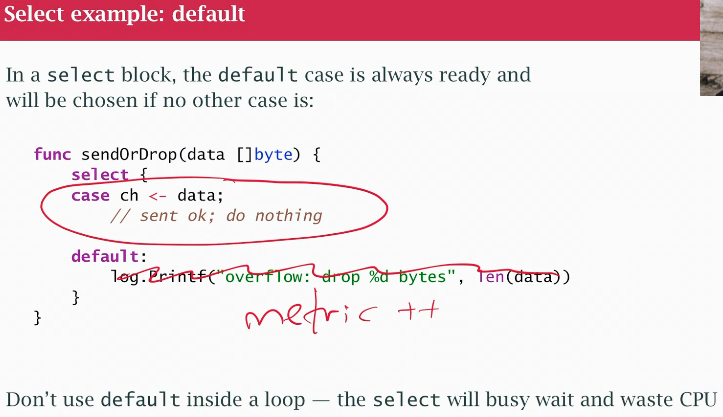

## class 24 select

- select statement for concurrency
- control stuctures: if, switch or for loops
- select is another control structure, allows to work only with channels and goroutines
- select is a control structure that works on channels
- allows us to multiplex channels
- Unix low level function select, poll and epoll: listen to more than 1 socket at a time
- several sockets if I'm building a server and I want to know which socket or sockets is ready to read
- build an efficient HTTP server using tools like select and poll 
- by multiplex: I can pay attention to more than one thing at a time
- Looking at channels instead of sockets or pipes or files
- We want to know which channels are ready, can I read from them? or write? But I can listen to more at the time
- mutex and condition variables DON'T multiplex, CAN'T LOCK THEM SIMULTANEUSLY, CAN'T WAIT 2 CV SIM.
- I can listen to more than 1 channel simultaneusly
- Often see select in for loop, prev example: parallel GET of webpages, reading a channel inside a loop. Now we'll put a select inside a loop to read more than once, from 1 or more different channels and we'll be listening to them at the same time

- Prometheus metric (to calculate how much was thrown away)
- if overwhelmed don't use nothing at all. Logs make it worse