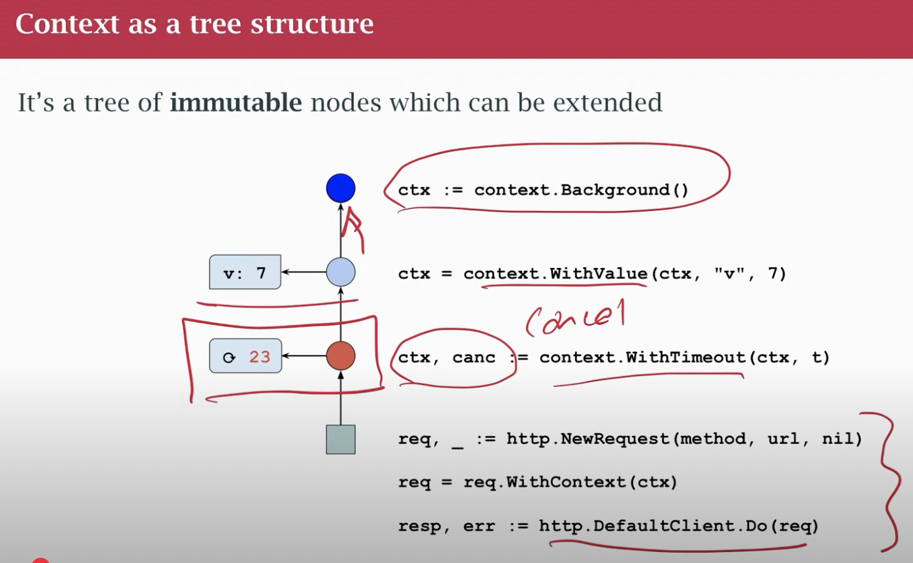
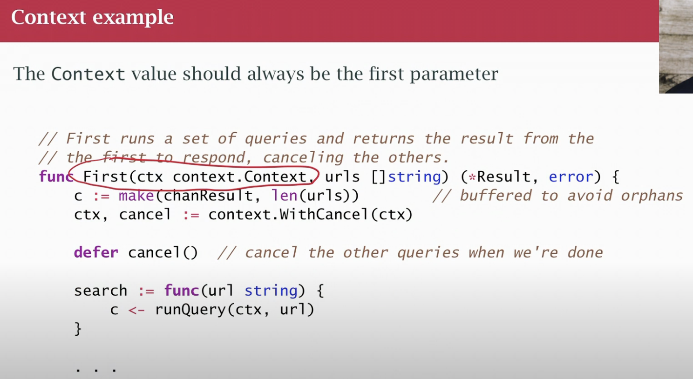

## class 25 Context Package

- Package
- Introduced in 1.7
- Common method of cancellation for work in progress
- Not specifically about concurrency
- Context works with select
- Via explicit (get cancel function that I can call, "hey this context is cancelled, drop all work related to it") or implicit based on a timeout or deadline (common timeout, handle everything within 3 seconds, at the end complete and timeout happens and I stop all the workd that isn't completed)
- CONTEXT CANCELLATION: tying together a bunch of work so it all  gets cancelled togetger.
- With context we get a channel, there is a function called `done`, if we call it gives us a channel we can listen on, when that channel becomes ready to read then we've been signaled, we should stop working. If we get that signal, there is another function `error`, if we call that we'll get a reason, maybe error timeout or explicit cancellation.
- We are gonna see `select` often, because we're listening several channel, `done` channel is likely to show up inside a `select` block
- The context is not one thing. Actually is a **tree**, usually, it has some root context (has no information) and as we add things to it, add cancellation property or timeout or cast context to carry a value along with it. We keep making more nodes in the tree. 
- Once a node is created is inmutable. Never modify existing context, you create a new context that points the parent above it. 
- Tree that can be walked from bottom, to see if its timeout, look up from bottom to the first context that has a timeout property.
- Immutable because we pass them in go routines. It would be a problem if they were not immutable
- Think about trees and subtrees. If I have a context somebody passes into me and I wanna add a timeout, create a new context that points to the old one. And the timeout applies downwoards. It applies to context I just created and any context derived from the one that I have now (any new children will point up to my context with a timeout. The timeout will not apply above it)
- I have an incomming HTTP request, add a timeout to it and start calling other outgoing requests to microservices. The timeout applies to me and those other calls below me, does not apply to the http request before I got it and started processing it, the context above me does not have my timeout. The parent context may have its own thing, but not mine. We don't modify a context, we add a tree.

- Leaking go routines is a bug. In a long-running server leaky go routine are your N1 problem. There's 2 things that can go wrong in a server, leak sockets or go routines. If you leak sockets, you end up leaking both. That's how you get a memory leak, almost always get a memory leak from leaking go routines not really from anything else.

- Buffer to avoid leaking, if the channel is buffered, it already has a certain amount of space, and so, people can store their results in the channel even if there's nobody ready to receive. Buffering disconnects the sending and receiving. Un unbuffered channel, the sender can't send unless the reciever is ready to receive. In a buffered channel, as long as there is space in the buffer, the sender can send, and the receiver will receiver later.

- A context is also a way to pass around values, we can attach some values to a context, say at the beginning of a query, and they're available in the various places we process that query below (call tree of function calls)

- WRONG! to treat context as a big bag of things to pass along

- OKAY to put the trace-id, google app engine app, every time app engine passes me an http request to process, it gives me a special header with trace-id, I take that trace-id and pass it around in the context of my program so that it can generate logs with that trace. Use it also to pass it to somebody else. Global tracing

- We need to put a key on a variable we store in a context, is kind of like a map. Need a key to look it up. Problem, key collision. The recommendation is create a private context key type (not string)