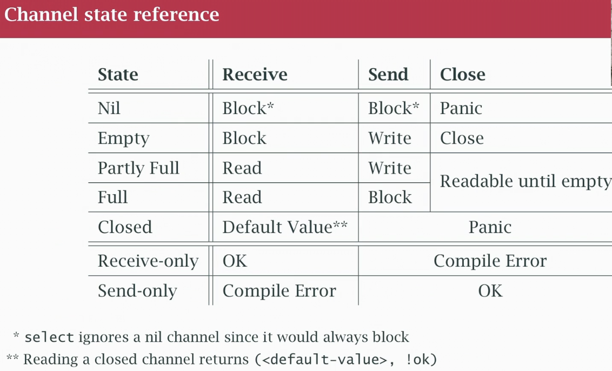
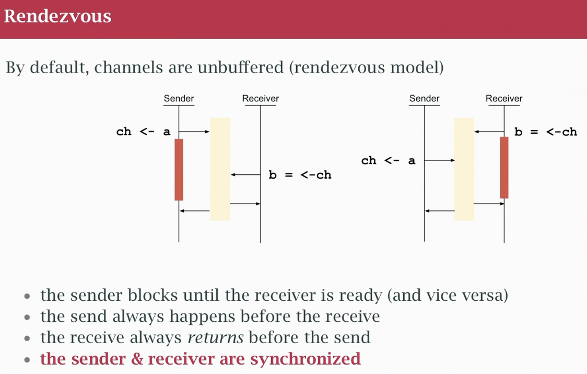

## class 26 Channels in Detail
- SEND SIDE a channel blocks when sending if nobody receives it (unbuf)
- SEND SIDE block because there is no space (buf)
- RECEIVE SIDE blocks if nothing to read
- RECEIVE SIDE can read from a closed channel

- channels are uni-directional (from one end to the other), (not full-duplex send and receive on both ends) over the telephone, both parties can talk over each other while listening 
- channel has read end and write end
- we can constrain (when passing to a funcion) by giving the read or the write end (information channel)
- channels are like maps, if empty can still read it, got a default value. Two-value read, the second value is a boolean, was it there or is empty? 
- I can read a channel, if closed, i get the default value. If i use the 2nd value is it the channel open or closed and getting default for closed?
- deadlock, no goroutines can be scheduled
- close a channel becomes is a signal for ready to read 
- a channel can only be closed once
- nil channel, default value of a channel variable. Can do nothing to it, can't read/write to it it will block. I can put a nil channel in select, it gets ignored.
- I can suspend a channel so i don't read from it, put the channel back to read

- rendezvous model (synchronization point, 70's term means a meeting at an agreed time and place). You get it with unbuffered channel. Whoever comes first has to wait for the other one
- UNBUF channel package requiring a signature, driver drives, comes up to the door, rings doorbel, waits for you to come to door and sign and then both continues.
- A BUF channel is like a mailbox, somes drives, put letters, you come and get them later. 
- Go routine leak, buffering the channel so goroutine has a place to write values and go away
- DONT BUFFER UNTIL IT'S NEEDED, JUST USING AS A COMMUNICATION TOOL, LEAVE IT UNBUFFERED, MAKE IT WORK AND TUNE PERFORMANCE ADD A BUFFER WHERE IS NEEDED TO RUN FASTER, HOW MUCH? EXPERIMENT BASED ON WORKLOAD AND HARDWARE.
- BUFF CHANNEL AS COUNTING SEMAPHORE: tool to limit work in progress or occupancy. Model it with a buff channel. If all used, nobody can send. And read to open space in the buffer to let someone send. if you can send, there is space to do work, when you're done liberate space. Wait until someone leaves.
- PERSON TO COUNT PEOPLE IN STORE, CLICKER, IF REACHED CAPACITY, MAKE A LINE, AS ONE PERSON LEAVES, ONE ENTERS. IF NO LINE OUTSIDE, EACH TIME SOMEONE LEAVES CLICKER COUNT DOWN.