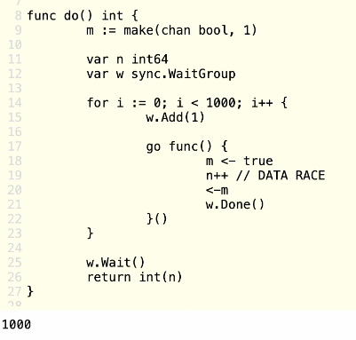
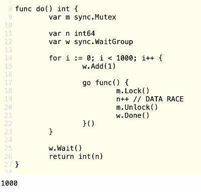
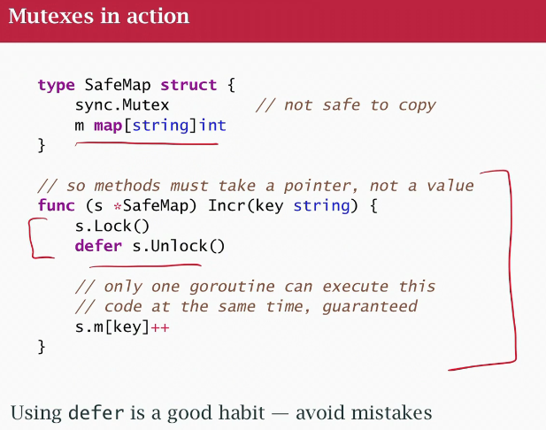
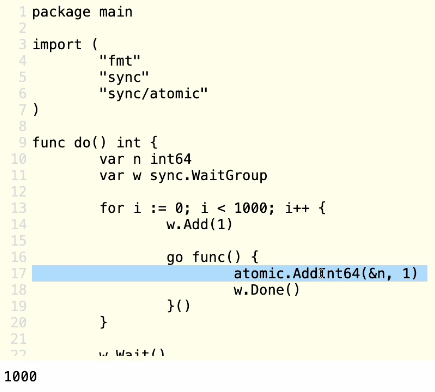
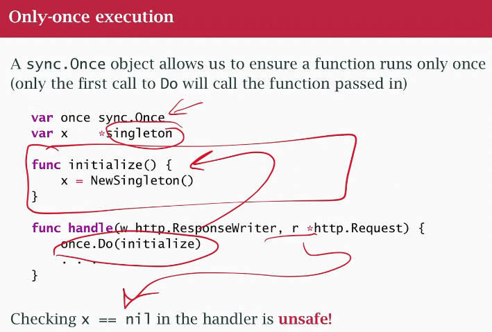
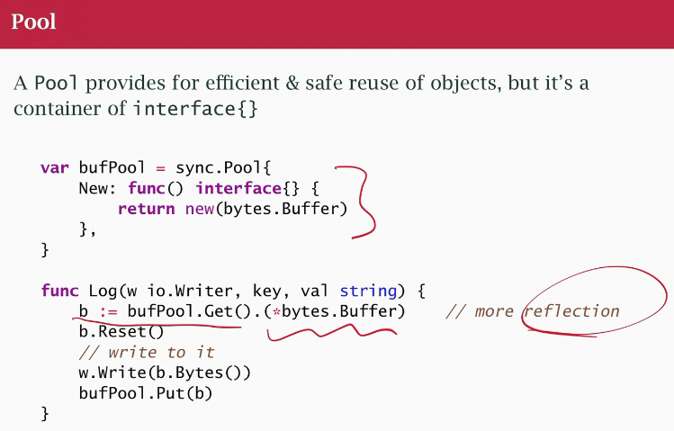

## class 28 Conventional/Traditional Synchronization Primitive

- basic or fundamental, the Go runtime needs them to implement select and channels
- conventional/trad around forever
- better to work with higher level CSP model

### Package `sync` and subpackage `sync/atomic`
- Solve mutual exclusion is about race conditions, make things read-only, and protect some piece of data, you look it, or you modify it, not at the same time. "critical section" excluse some
- acquire lock, everybody needs to wait until I release it

With boolean channel: 

using a sync.Mutex:

Original map in go is NOT go-routine safe!!!

Safe map:

There is a mutex inside a channels, embedded, use the channel and the right things happens

### Atomic primitives 
- More limited, tied to the hardware, "cheaper"

### Singleton (only-once execution)

### Pool

