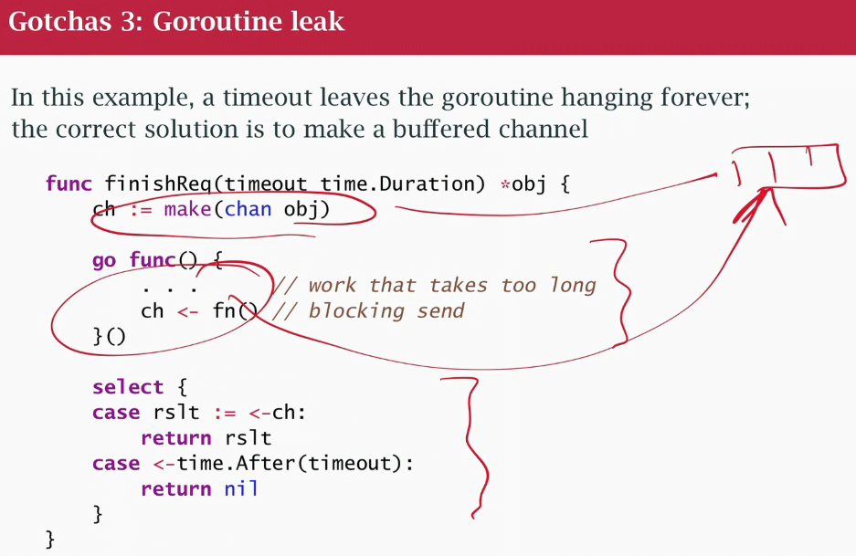

### class 30 Concurrency gotchas
- race conditions: protect thing that are shareable and modifiable
- deadlock no goroutine can make progress
- goroutines leak: when you start a goroutine ALWAYS know how/when it will end (leak a socket, or a goroutine is waiting for something that will never happend). Memory leaks, almost always tied to goroutine that didn't go away
- channel errors: try to send to a CLOSED CHANNEL, try to send/receive on a NIL CHANNEL, try closing a NIL CHANNEL, closing a channel TWICE
- other errors:
- closure capture
- misuse of Mutex
- misuse of WaitGroup
- misuse of select

- There is no way to compose two mutex, you lock one and then the 2nd 
- Dyning philospsher problem (2 people 1 pair of fork, need both to eat). Have m1 m2 mutexes, always lock in the same order, avoid the problem of I have one you have the other

- goroutine that want to write to a channel
- only 1 receiver that can timeout and quit
- if that happens before the goroutine sends, we can leak the goroutine because the channel isn't buffered
- solution is to buffer a channel, the goroutine has a guaranteed place to write its response even tought the response is going to be though the response is going to be thrown away because it's too late

- when tracking a unit of work, using WaitGroup, add one to the WG first and then start the unit of work

- Closure capture of a loop variable loop variable (nothing to do with goroutine, pass the variable as a parameter, so it creates a copy. local copy inside the function)

- Select problems:

- default is always active: if nothing else matches/ready to go you're gonna take the default. If put select inside a for loop, eatup a lot of CPU
- nil channel, ignore channels that are nil, no longer part of the select
- skip a full channel, can't send to a full channel, block
- a "done" channel is just another channel
- available channels are selected random, if 2 or more channels are ready it will randomly pick one, not top to bottom
§
RULES:

1) Don't start a go routine without knowing how it will stop
2) Acquire locks/semaphores as late as possible, release them in the reverse order (if use defer, it will my locks will be unlock in the right order)
3) Don't wait for non-parallel (work that can be sequential) work that you could do yourself
4) Simplify, review and test
