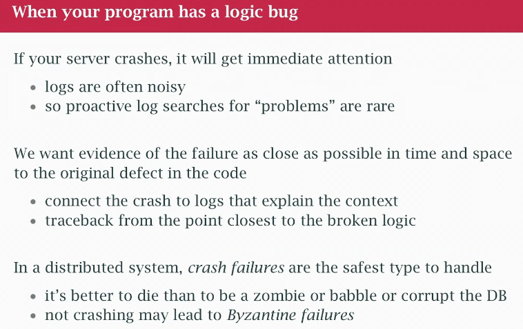
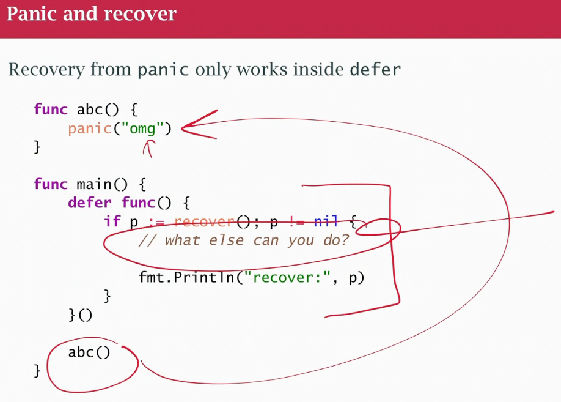
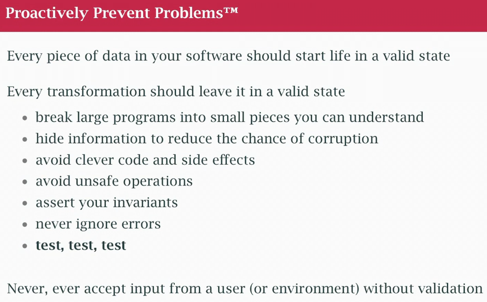

## class 32 Error Handling
- Error is just a string, wrapped in an some internal object
- print it for debugging
- Error is an interface, anything that has an error method, so we can create other concrete types that can represent this

```go
type error interface {
	Error() string
}
```


```go
type Fizgig struct {}

func (f Fizgig) Error() string {
	return "Your fizgig is bent"
}
```
- Create a more useful Error
- Error variables, each is instance of struct
- custom error, taking error, getting some information and returning 
- Wrapped errors: wrap one error in another, "chain" TOP LEVEl (top-level error -> intermediate error -> original error)
- Unwrapepd method to return the underlying error, if NIL bottom of the chain
- `errors.Is` (compares with error variable) check if error has another error in its chain
-  `errors.As` (compares with error Type) go the error chain and extract the error of this type.  Think of it as downcasting, given an error, can i downcast it to an error of this type (may not be the top, in the chain)

### Errors in Go
- Normal errors: edge condition caused by input (user or doing a network query and get a response)
- Normal External conditions: is the network available? out of memory?
- This edge conditions are things you expect to happen as you write your program, use the network? network could be unavailable or the thing you are trying to talk isn't there. Dealing with Files? filename mistyped or file is moved, disk out of space
- They are part of your program logic!!
- Abnormal errors: edge conditions cause by bugs by programmer, nil pointer, reading past the end of the array, Go panics, crashes the program
- go fix the bug, rebuild the program, redeploy (use panic function)
- **"IF YOUR PROGRAM HAS A LOGIC BUG CRUSH IT: FAIL HARD, FAIL FAST (unless safety critical program)"**



- if program crushes, the system testers are gonna write it a bug report, bug get surfaced earlier
- debugging in distributed system, different processes, rpc to process, it has an exception, wrap and sends in the response rpc to me. No, get evidence of the failure as close as possible in time and space
- We use Go to build distributed systems and in a dist. system the easiest and safest failure to deal with is a "crush failure" process just dies, gone. In most well-designed dist systems that's OK, because typically you have more than 1 instance and have it behind a LB, one goes aways other can handle traffic, create another instance. 
- If a program has a logic bug, it's corrupt, corrupt state internally, letting it run continue in that state and corrupt other things or turn into a zombie and consume resouces or be part of DOS attack or start babbling bad messages on the network and corrupting other processes and cascading failure your whole system goes down or corrupt databases. Byzantine failures are hard to deal with it, crush failures are safe and easy so the best reason to PANIC and DIE (becomes corrupted internally) meaning it has a logic bug. CRASH. We'll the pick up the pieces and looking from a debugging perpective and the rest of the system will continue safely. We use panic when are assumptions about our code are wrong, if we get a nil pointer error and must assumed it wasn't nil or off by 1 error, crush.
- Exception handling: "graceful degradation" if one engine in plain dies, continue with the other, can't crush the program. Exception handling introduces invisible control paths, hard to analyse.
- Officially Go doesn't support exception handling (it has panic and recover)




- unit tests, run a test, test creates a panic, use it to capture the panic and create a message to avoid crashing whole set of unit tests.



- AVOID being "clever" and always test

- Verbose if err !=nil, we handle errors, we make them visible, explicit