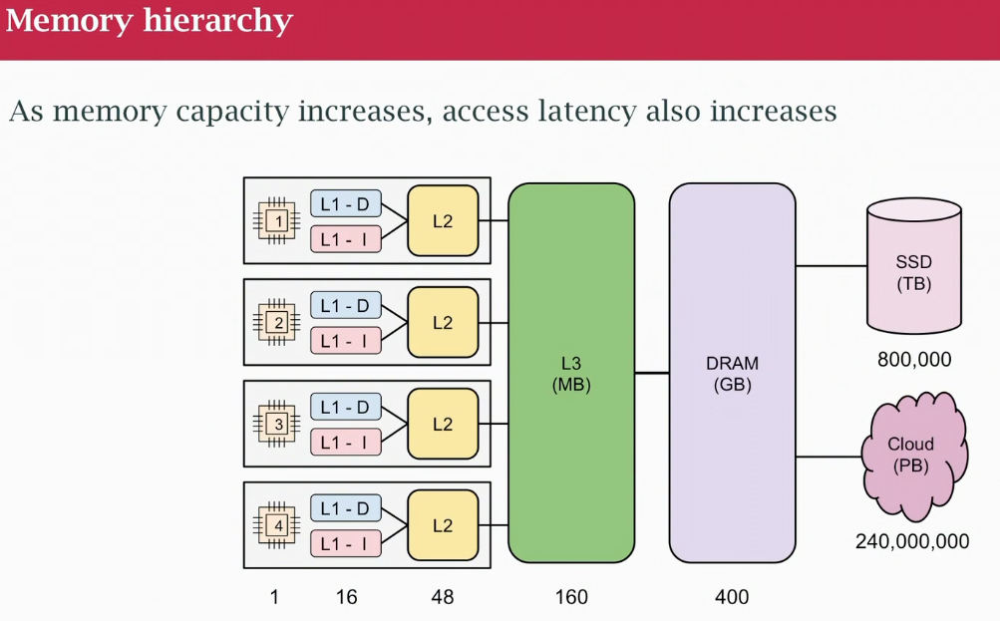
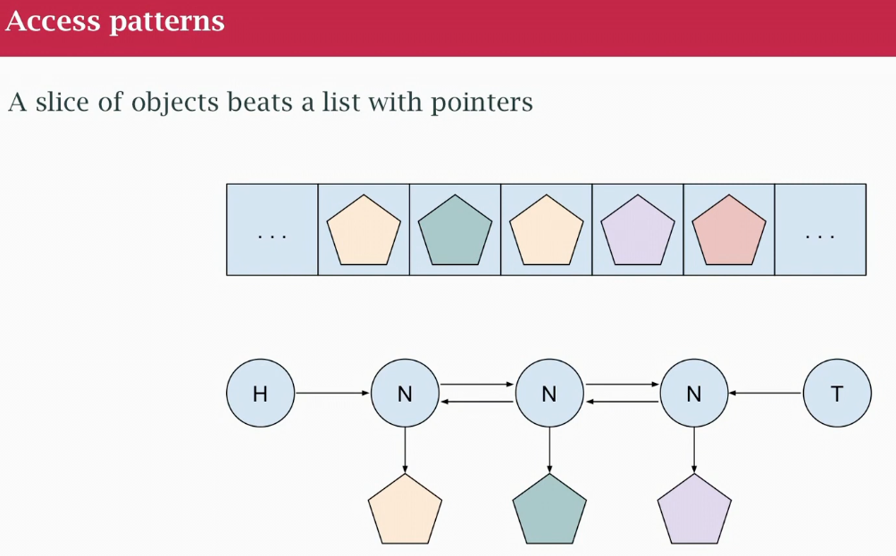
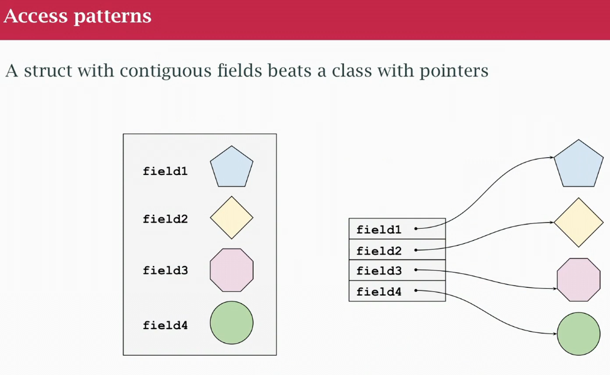
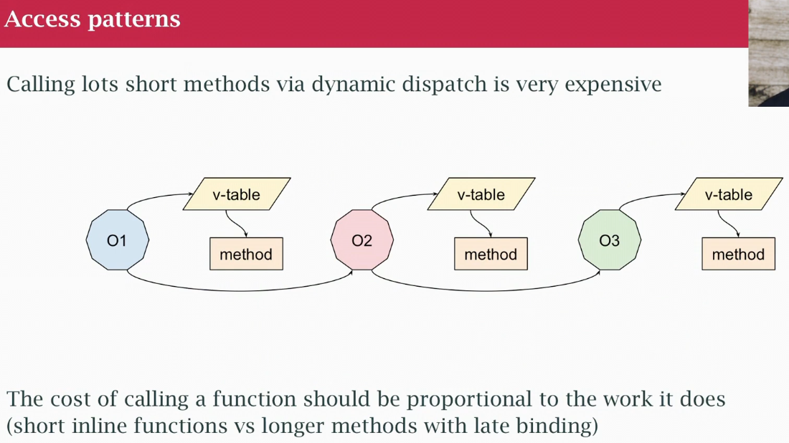

## class 34: Mechanical Sympathy
- term from racecar driving goes back a while
- understand how the car works is better driver and get more out the car
- understand how our machine works
- go is to build in the cloud
- already give up some things: archicure: microservices (overhead of overhead in communication, cost of development and operation)
- code: read it and mantaining
- optimizing? Topdown: architecture, design (algirthm, concurrency, layers of abstractions), implemntation (programming language and how we use memory)
- MEC SYM: implementation level of things
- Hard to do MEC SYM with an interpreted language (vs compiled language), they are designed to abstract away the machine away from you (can't see it)
- Abstaction is expensive
- 2005, processor stopped getting faster, increase in the number of cores, limitations of hardware (keep having more transistors)
- Can't make a chip twice as fast (clock speed perspective) every 18 month
- Gap between performance of CPU and memory
- Keep making CPU faster, we can't do that with memory 
- CPU chip and memory banks in a motherboard. There is a distance d between them, physical connections can't be faster
- Ever growing gap between CPU and memory (1 cycle to do and addition 20,40,100 cycles to go out to memory, read a value from memory into the chip so we can do the addition, the memory read stops the chip from processing until we get the memory) solutions that helps but this is the reality:
    - Chip isn't getting faster
    - The gap between cpu and memory isn't gonna shrink
    - software keeps sucking up performance faster than hardware makers can make it
    - Software development costs exceed HW costs
- SW gets bloating and eat up CPU capacity, lots animations, etc. SW is being written inefficient way
- Interpreted lang have built-in inneficiency based abstracting away the machine
- **MEC SYM make the SW work with the machine not against it**
- We can make the SW concurrent cause we have more cores, this is also MEC SYM, or we can make the SW suck less

### Generic x86 design

- 4 cores 1,2,3,4 chips, core does actual calculations, only place calculations happen
- design multiple levels of cache:
    - L3 is shared
    - L1 and L2 are per core
- numbers in a down in the bottom are relative to a clock cycle (not exact por any particular chip model, illustrative). 
- When go off the core to L1 and L2 cache (tied to that core) we are lookin an order of magnitude latency to get the memory
- to L3 or main memory, 2 orders of maginitude 
- to SSDs and network it takes a long long time to get out there
- it's expensive in terms of latency, the wait time, we get around that: CPU gets to reorder some loads and start them earlier so the results are available a little sooner (there is a limit to that)
- **The cost of doing computational work is driven by the cost of reading memory**. How long does it take? Those latencies of fetching from memory have a real impact. Answer to this was cache
- In 1980 we didn't have cache, it wasn't a thing, wasn't needed
- Cache attempts to use patterns of access to make that cost (latency) less visible
- It have limits: have to fetch data in units of a cache lines (64 bytes chunks) thats the unit we also use to read main memory. We read 64 bytes from main memory, bring it to L3, to L2 and L1 (it takes a long time) and CPU can get a byte or a word out of L1 cache

### Memory caching
- We now have multiple cores, and each has a copy of L1 or L2, **sync is requires**. Cache lines can also have race conditions, managed in the HW (invisible to you or your program) is an overhead/tax that you are paying.

### Locality
- Cache exploit a property exploits LOCALITY:
    - in space, if've used somrthing I'm gonna use thing next or close to it (that's why we read a cache line)
    - in time, if I've something, and then probably I'm gonna reuse it
    - Gonna read all the cache line and use that from multiple reads in a short period of time
    - catch: was designed for big math programs, hi performance computing, matrix multiplications. If not that kind of program, isn't gonna work as well for us

### Efficiency
- Caching is + effective if we use the whole cache line and process memory in Sequential order/access. Keep code or data in code longer
- Cache is - efficient: sync between CPUs, cost of moving chunks of memory around (4k block coming in off the network, copied that 4k block in != places in the process of serilizing and sending to another, copies can be very expensive). Non-sequential access patterns, if it's code is about function calls, if it's data is more about chasing pointers. A little bit of copying is better than chasing pointers to go find things.

- slice are more efficient than a linked list of pointers

- better to have a bunch of data inside a struct (contiguos, field with data together in memory) than object with a bunch of pointers to other objects (cost of pointer chasing)

- cost of short method call, forwading method, bad "forwarding mehtods". Too many layers of unnecesary abstractions, they are expensive, because I have to go out and get pointer to object and to v-table that has pointer to method...again..again. Last method does work and returns it. Take little piece of work and magnify it 100x more expensive because extra dynamically dispatch method calls. Regular funcions have overhead, short functions have overhead, method calls because they are dynamically dispatch adds more overhead. Avoid unnecesary layer of abstraction,. Opinion: avoid 2-3 line methods, not good idea. 

### Sync cost 
- Mutex, we expect to cost to lock and unlock it. A log of goroutines hit same mutex, race conditions are a problem, solve it with mutual exclusion. 2 cores, no race condition between variables. A weird happens if they endup in the same cache line. 2 cores can't write on the same cache line at the same (risk). HW bounces back between 2 cores, a couple of heavily used variables happen to line up in the same cache line even tough they re not related ,nor have mutex. Issue is the behaviour of the cache.

### Other cost
- Disk access, we don't have control about where disk blocks are on the physical disk. Can't control. Garbage collection is important. Avoid creating gargage (reduce the memory allocation)
- Improve speed of collection by not having objects with lots of pointers in them.
- Get better performace in use larger heap, use more memory.

### Optimization
- Go allows us to do MEC SYM
- not hiding cost
- make code and logic explicit to see it
- "do less" insted of trying to "do it faster"