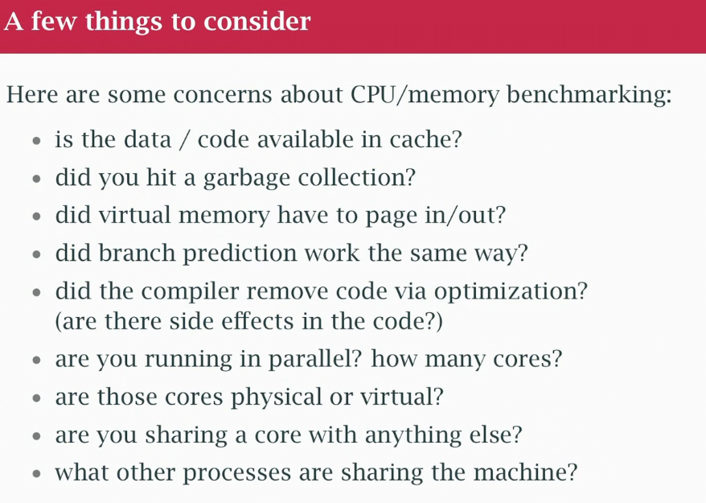

## class 35 Benchmarking
- Go's benchmarking tools

```
➜  addBenchmark git:(main) ✗ go test -bench=. -benchmem

goos: darwin
goarch: amd64
pkg: addbenchmark
cpu: Intel(R) Core(TM) i5-1038NG7 CPU @ 2.00GHz
BenchmarkAdd-8          1000000000               0.3167 ns/op          0 B/op          0 allocs/op
PASS
ok      addbenchmark    0.359s
```
- BenchmarkAdd-8: Your benchmark name running on 8 CPUs
- 1000000000: The benchmark ran 1 billion times to get accurate timing
- 0.3167 ns/op: Each Add operation takes 0.3167 nanoseconds
- 0 B/op: 0 bytes allocated per operation - no memory allocations!
- 0 allocs/op: 0 memory allocations per operation

## Examples Fibonacci 
- with recursion vs using a for loop
- ns/op is time to do funcion inside benchmark loop
- Fib recursive is inneficient, a lot of calculations + overhead call function
- Not as efficient as possible doing all logic in REGISTERS (enough cache operations vs registers)

## Slice vs Linked list
- slice vs linked list with value in node 20x difference, if making the list is separate difference is 3x
- slice is reading contiguosly, pull in cache line, entire cache line
- LL going pointer to node, pointer to next and node, may be on cache lines all over the place in different parts of memory. Efficiency is better in slice
- Use node with integer separate, 3.5x
- `-bechmem` memory allocation flag

## Forwarding example (layers of abstraction)
- 8-9x time difference
- to 20x taking into account the making of the forwarding layer itself

## False sharing example
- number of workers, write to a channel
- `-cpu=2,4,8` option threads
- cache line has to bounce back and forth between the cores, possibly going back to MM back and back
- everybody fighting for same cache line because only core can change it at the same time
- use local variable and when done write back one time
- we will have go routines attempt to write the cache line once at the end
- the rest of the program not figthing for the cache line, they are using a local variable on a stack of a separate go routine, we know they are NOT going to be in the same cache line

