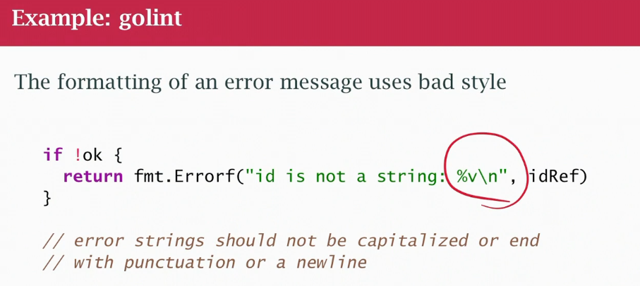
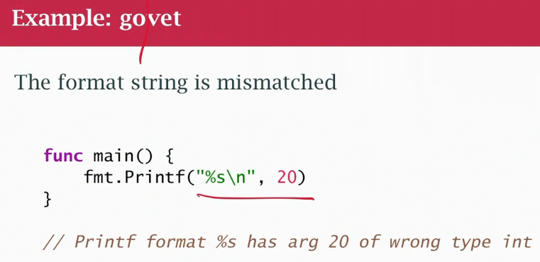
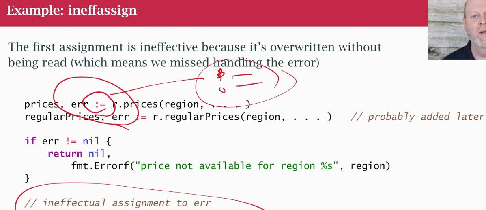
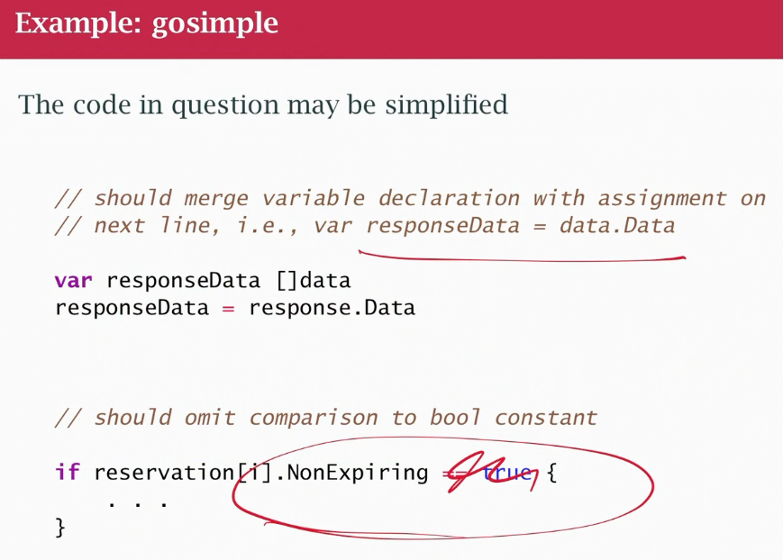
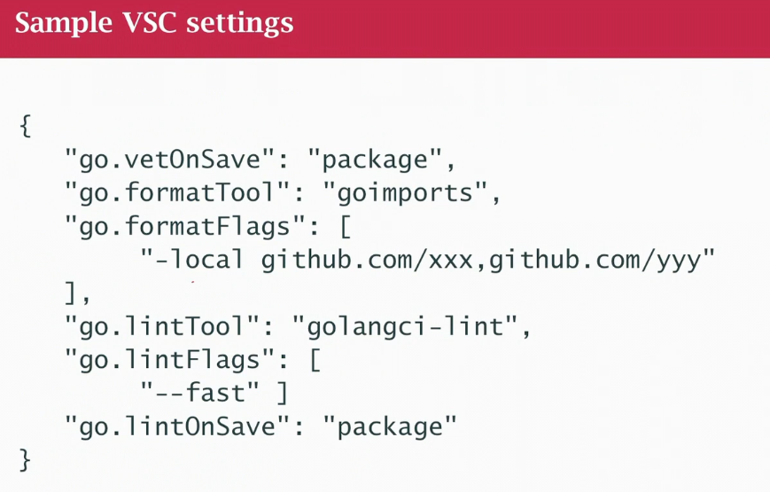

## class37 Static analysis (linting)
- set of tools and a practice to make your code better, to allow looking at it before you run it
- compiler compiles code
- tool inspect your code and help you before you actually run the program
- Readability of sw, maintainabily, more readable is better, focus on helping the reader
- we read more than writing code, need clean code
- the static means we are not running the program, sitting on disk
- tools improve correctness, efficiency, readability, maintainability (style)
- `gofmt` formatting tool
- **start clean stay clean** tools and practises from day 1
- static analysis before running unit tests
- `goimports` fix formatting and import list
-  `golint` stylistic issues based on rules from Effective Go and Google. errors should use `\n` 

- `go vet` looks for actual code issues, using 20 but using %s string

- **No static analysis tool can find ALL possible errors** the same way the compiler can't
- `goconst` finds literals that should be declared with `const`
- `gosec` looks fro possible security issues
- `inneffasign` finds assignments that are innefective (assignment that doesn't do anything useful). Check err only from the 2nd call (ignoring the 1st) "shadowing" (`:=` allow shadowing variables)

- `gocyclo` reports high `cyclomatic complexity` in functions. Based on how many logic branches it has, ifs, loop, if too much break it down
- `deadcode`, `unused`, `varcheck` find unused/dead code. Functions not used
- `unconvert` finds redundant type conversions
- Some will be `false positives`
- `gosimple` shows code can be simplified

- `golangci -lint` we run all those tools using this
- configured with `golangci.yml`
- We use this in your CI/CD pipeline, together with building, lintint, runnint unit, integration test, the deploy, post-deploy test
- `//nolint` comment if think is positivescan

### VSCode settings

- GoLand tool to work