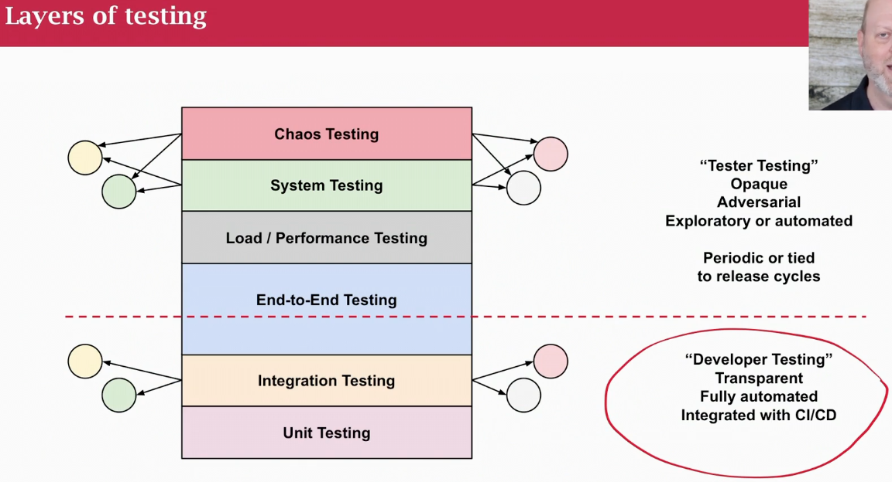
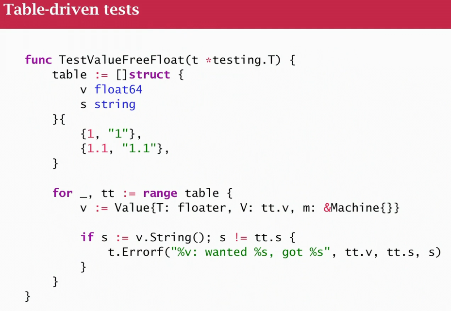
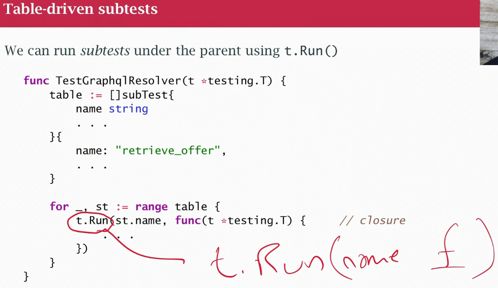
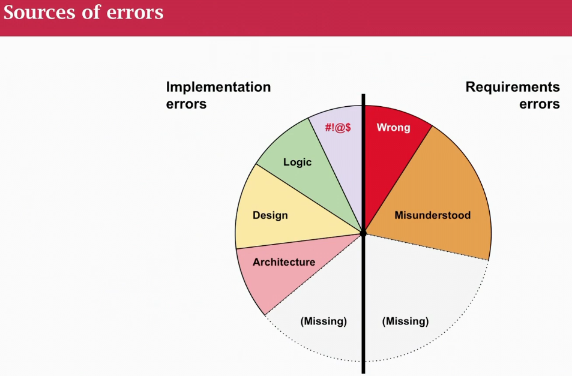

## Class 38 Testing
- built-in test tools
- test files end with `_test.go` and have `TestXXX`functions (can be in the package directory or separate)
- run with `go test` (test aren't run if source wasn't changed since the last test)

### Testing goals
- boundary conditions
- extreme values
- input validation, how you handle errors? 
- deliberately creating errors
- Another dimention: "Transparent"(you know about the software)/"Opaque"(test from outside) (black/white box)
- Deployment test, after ci/cd deploy something to the cloud, have it nor work (typo in config file)
- UT unit test: they are self contained, no need network, credentials, don't talk to another microservice and no talk to real db unless I can start a db under the control of my UTs
- IT integration test: should test the part non testing UTs, actually talking to other microservices by mocking/faking some part of code is never reach (typically run in cicd's) go out with other people microservices: test credentials are properly inserted, properly hooked up and talk
- take a `*testing.T` to report errors. Use `fatalif`
- run a test with a range of values

- Table-driven sub-tests
- `t.Run` run as individual subtest

- Mocking or faking
- Test main functions, takes `*testing.M` use `m.Run()` to run all UTs

### Testing culture
- Test are the contract about what your software does and does not do
- You have a package, and UT and this are regretion test and documentation
- If "put a bug" and UTs don't fail is because they don't work or not enough coverage
- Assume your code doesn't work unless: you have tests (UT and IT), they work correctly, you run them and they ALL pass (ripple effect of changes, run all tests, not a subset!)
- Your work isn't done until you've added or updated the test to reflect the changes you made to the software (and they run and make sure they work). Don't create an additional ticket for testing.
- "Start clean, stay clean" 
- Mental models are sometimes wrong, failure of imagination. Developers test to show things work (according to their understanding of the problem and solution)
- What does it means for a program to be right?
    1)  it compiles
    2) has no bugs that can be found just running the program
    3)  it works for some hand-picked test data
    4) it works for typical, reasonable input
    5) it works with test data chosen to be difficult
    6) it works for all input that follows the specifications
    7) it works for all valid inputs and likely error cases
    8) **it works for ALL input**
- "IT WORKS" means produces the desired behaviour or fails safely
- fuzz testing, generate a bunch of random junk and see what happens
- chaos testing
- Most people reach 4) and 5), need to go past that

### Where do the errors come from?
- didn't understand what its supposed to do or the language or logic of the program or maybe just a dumb mistake
- There are 4 types of errors:
    1) errors in understanding the problem requirements
    2) errors in understanding the prog lang 
    3) errors in understanding the underlying algorithm
    4) errors where you knew better but simply slipped up
- Some errors gets better with experience, mistakes happens (we have code reviews and testing)
- Type 1) errors get bigger as programs get become bigger and more complicated and information as "what we think it should do?" becomes less specific

- **Big chunk of errors is because we write software without a clear understading of what we think it should do**

### Developer testing
- Aim for 75-85% code coverage (100% false sense of security)
- unit tests
- integration tests
- post-deployment sanity checks

- **Everything you deploy in staging and production should be 100% good (intention)**
- **Testing should be part of documentation**

- test != QA
- QA manages quality process overall, dev, testing, sw support, not testing
- Testing is about showing that it doesn't work
- It's hard to do testing when there is no documentation
- UT helps docs but it's not enough
- Not enough testing and not enough docs are sources of technical depth
- Pick any 2: good, fast, cheap