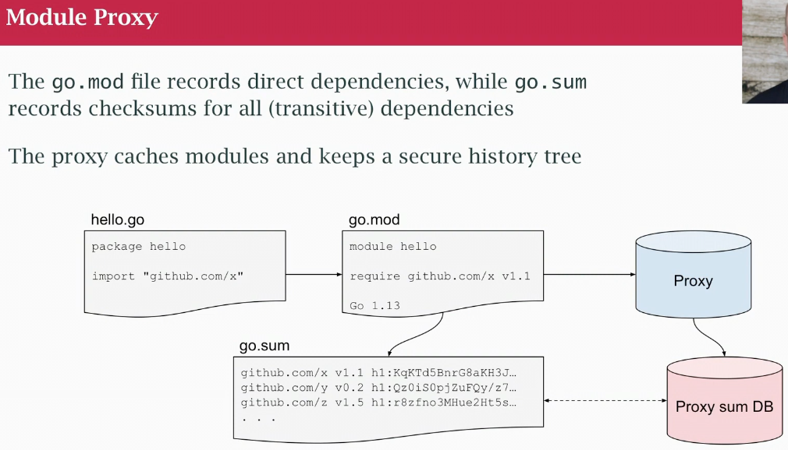
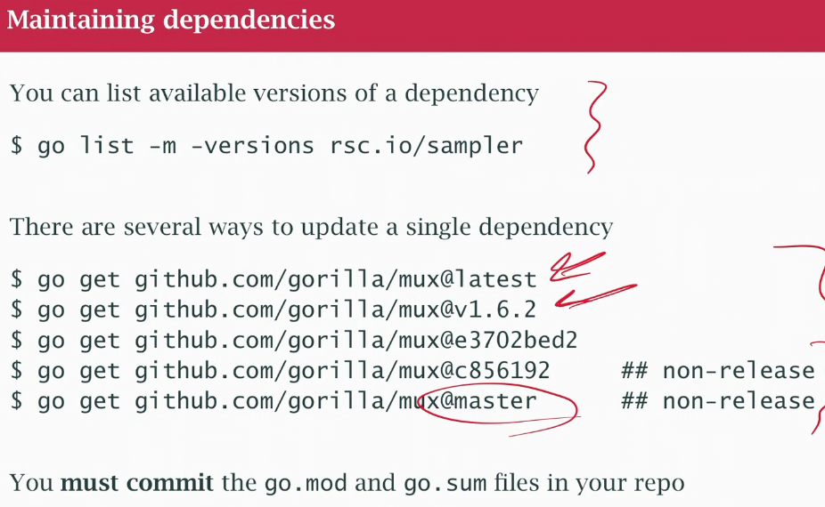

## Class 40 Go Modules
- Go modules invented to handle the dependency management problem
- Program uses 3rd party libraries, in places like GH
- Clone the repo, build some stuff, move it around, didn't work well
- Java Maven, JS has npm
- Help you identify what does your program needs, get it, get the rigth version and deal with some issues
- Make sure is still available and is safe
- Vendoring, get all you need, copy them into your repo and you version control your own things, can get rather large (node modules)
- Go modules provide dependency management that works as vendoring (without doing it)
- Dependencies are available and secure
- The Go system is going to try to make sure those modules are always available by having a proxy server keeping it secure
- Work well with the Go ecosystem
- Dependencies are a risk and Go modules and Go proxy server risk move it away or hacked version
- Is the original package secure? CAVIAT EMPTOR "let the buyer beware", maintained? tested? safe?
- **"A little copying is better than a little dependency"** and a little depency is better than big messy depencency
- Semantic versionning, major numbe changes are incompatible. May need to import old and new packages
- `go.mod` recording of your module name and direct dependencies (things you use using import statements)
- `go.sum` has cheksums for all transitive dependencies (indirect packages as well)
- ADD THEM AND COMMIT THEM WITH YOUR CODE
- Env vars: 
    - GOPROXY = proxy server (may have a private or corporate proxy)
    - GOSUMDB = sum provided by go
    - GOPRIVATE = for private repos
    - GONOSUMDB = for private repos
- Remember also you must be set up for access to private Github repos in order to download modules
- Your code imports things, the things you import end up in go.mod and go.sum records checksums for all

- go.mod may record "pseudo-versions"
- cloud.google.com/go v0.35.1 (tag somebody put into their git repo)
- github.com/gen2brain/malgo v0.0.0-2018.-af6b945hd is a pseudo version, taken off somebody trunk out of the repo without a tag, wasn't a release version from the pov of git or github (is a date and a commit hash version 0.0.0)
- Most people use release version, tagged for release
- `replace` directive `=>` "instead of getting 1.2.0 go and get this other commit off the trunk to use in place of broken version"
- `go.mod init <module-name>` when starting a program, module name is the repo
- `go build` go get and build the go.mod up until 1.15
- in 1.16 treat `go.mod` as read-only, forced to do `go get -u ..` to get things you need (find current most recent version)
- `go mod tidy` make sure things need to get removed are removed
- You must commit mod.go and go.sum with your changes
- `go list -m versions rsc.io/sampler` list available versions of a dependency

- You can still vendor `git mod vendor` can do vendoring as part of build process (hide go.mod and go.sum)
- Go keeps a local cache in `$GOPATH`/pkg of each package and the hash of the roor checksum db tree
- can clean it using `go clean -modcache` to remove ir all
