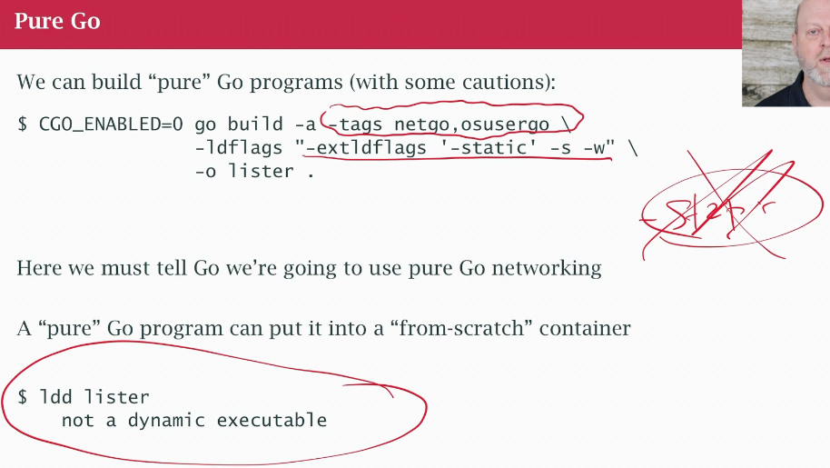
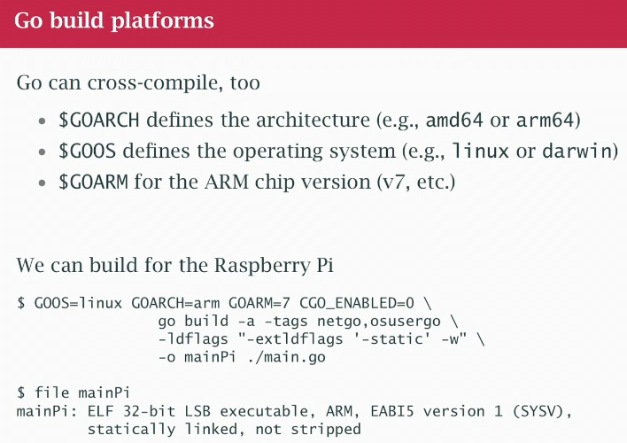
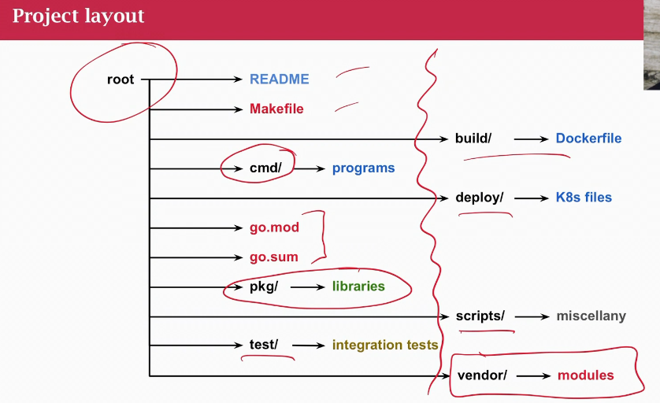

## Class 41 Building Go programs
- `go build` makes a binary, a separate binary you can move somewhere or run
- `go install` make and copies to `$GOPATH/bin`
- it has various options
- build a pure go program? has no dependenies of any kind outside after what's in the binary after is assembled
- "runtime dependencies"
- statically link the go code, might have dependency on your std libs laptop or other container, libc for example
- java jvm it has to have libc
- goal: provide a go binary completly contained in itself, it doesn't need anything
- so we can put in en "empty" docker container, does not have libc, or parts of os, no runtime dependencies
- so 1) container is very small (jvm and os with java project was 1GB vs go binary 20-30MB) 2) security issues, no vulnerabilies, maybe open 1 port, that's all
- no single flag `-static` to do the "right" thing
- tags `netgo` `osuergo` tell std go library use own version, not libc versions (the library you get in the OS distribution)
- tell them to linkt it statically, strip it and so on, so nothhing extra in it
- get a not dynamic executable, no runtime dependencies on dynamic libraries
- hot in the 80s when Unix was new, most machines were small, memory constraints (1-4MB or less of meain memory)
- most people build unix software by getting the source and build them on their machines locally
- didn't get binary distributions and pick up binary packages like we do with apt-get and so on
- in the 90s we got dynamic library hell
- Having a not dynamic at all is very good
- can't build a statically linked binary on mac for mac (apple security and libraries) but I can cross-build from mac to anything else
  

### Go build platforms
- there are several variables you can set about the platform you are building for
- the go build tool is a cross-compiler right out of the box
- I can go on my mac and build and executable for linux on x86 or for the raspberry pi using arm 
- we can tell it what architecture to build for
  
- then copy the binary by itsel to my rasperry pi and run it (build it, scp to copy, ssh into raspeberry and run the executable)

### Project layout
  
